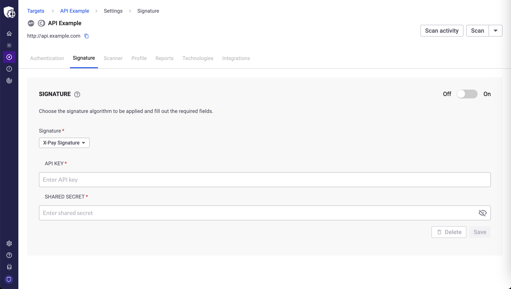

# Configure signed requests

Configure signed requests to ensure data integrity and authenticity for your API targets in Snyk API & Web.

Signed requests are a security practice used in APIs to ensure the integrity and authenticity of data transmitted between a client and a server. They contain digital fingerprints, often using algorithms like HMAC-SHA256, JSON Web Tokens (JWTs), or custom algorithms, to confirm the sender and prevent attacks by validating specific header fields or the entire request body. This practice is crucial for securing sensitive financial or data operations.

## Prerequisites

To configure signed requests, you must have:

* `change_target_settings` permission

Additional requirements:

* Signed requests feature enabled for your organization (Contact Snyk Sales)

## Configure signed requests

If your target requires requests to be signed, configure the signature in the target Signature settings.

1. In Snyk, navigate to the **Targets** page.
2. Identify the target you want to configure and click the **gear** icon to access the target settings.
3. Click the **Signature** tab and identify the **SIGNATURE** module.
4. Select the **Signature** you want to use and complete the form accordingly.
5. Click **Save**.

<figure><figcaption></figcaption></figure>

## Verify signed requests

After you save the configuration, signed requests are enabled. The next time you run a scan against this target, Snyk automatically uses the configured signature.


For your security, all sensitive fields (such as certificates and shared secrets) are obfuscated after they are saved and cannot be viewed or retrieved again.


## Manage signed requests

You can manage these settings at any time from your target **Signature** tab:

* To temporarily disable a setting, use the **Off/On** toggle.
* To permanently remove a configuration, use the **Delete** button.
