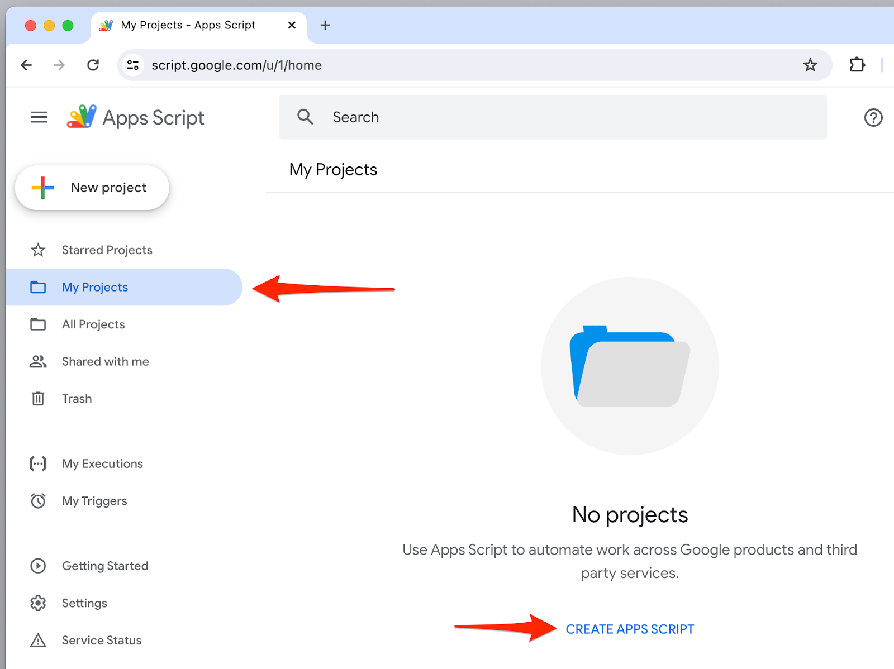
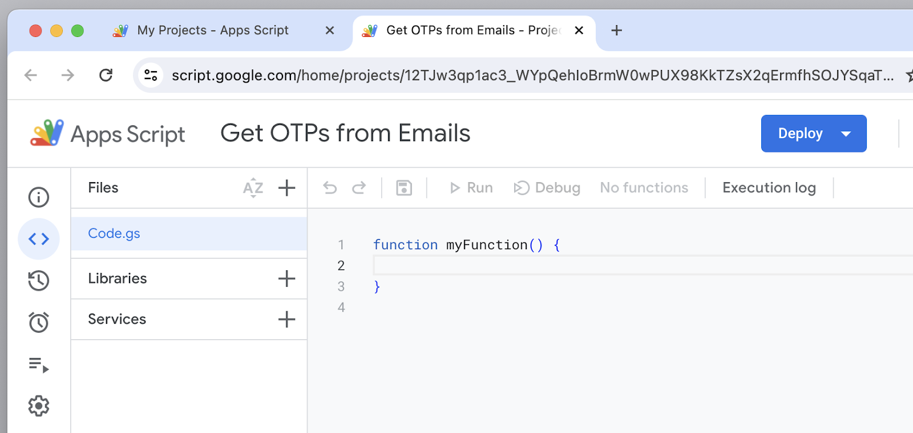
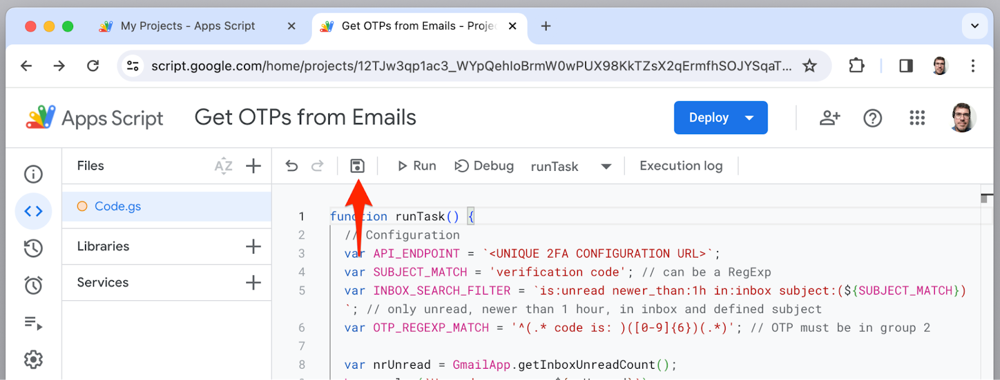
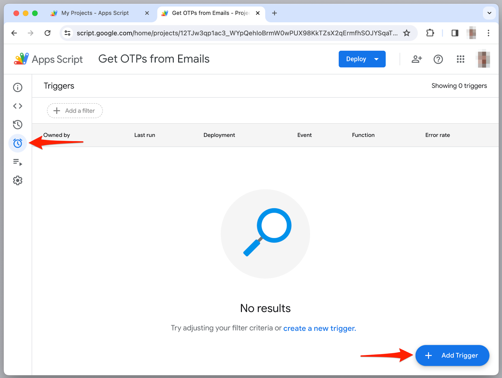
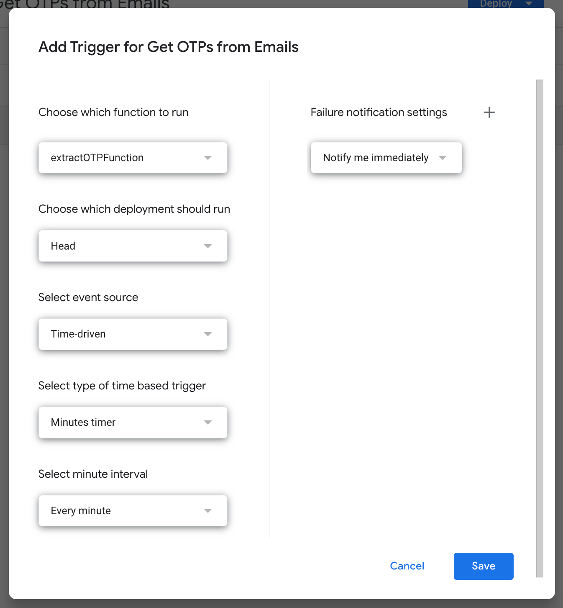
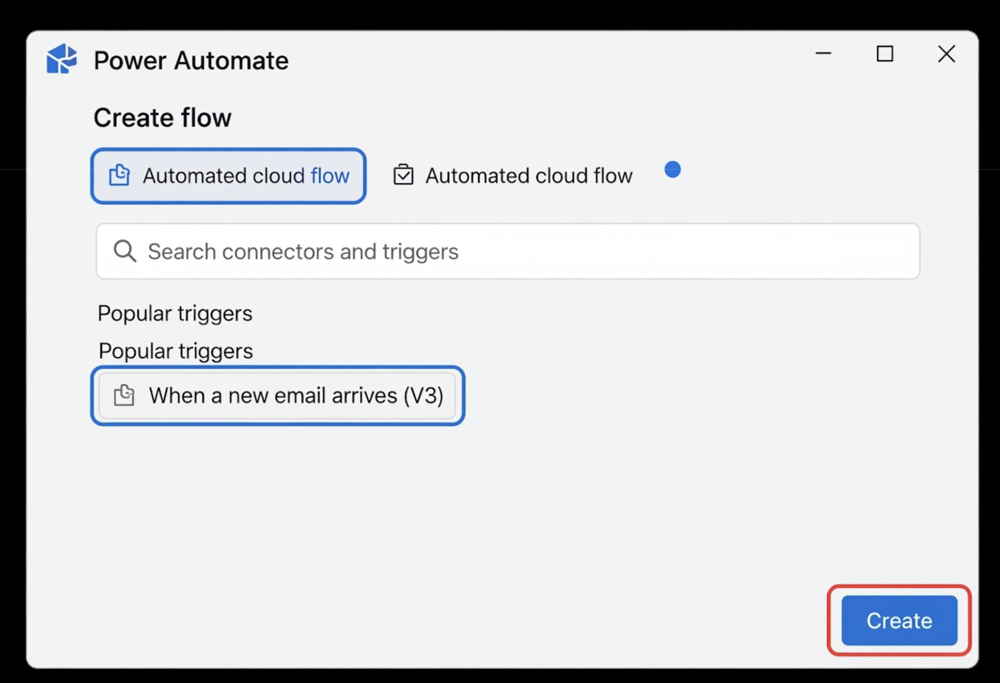

# Automate OTP extraction

Automate the extraction of one-time passwords (OTPs) from email and send them to Snyk API & Web for two-factor authentication.

When using alternative OTP for two-factor authentication, you must send the OTP code to Snyk during scans. You can automate this process by creating scripts that monitor your email, extract the OTP, and submit it using the Snyk API.

This article provides examples for automating OTP extraction using:

* Google Apps Script (for Gmail)
* Microsoft Power Automate (for Outlook)

## Prerequisites

Configure alternative OTP two-factor authentication for your target before proceeding. Visit [Configure two-factor authentication (2FA)](configure-two-factor-authentication.md) for setup instructions.

You need the **UNIQUE 2FA CONFIGURATION URL** from the Authentication settings of your target.

## Automate OTP extraction from Gmail

Use Google Apps Script to automate OTP extraction from Gmail accounts.

The script polls emails from the Gmail account, extracts the OTP using a regular expression, and sends it to Snyk through the API endpoint.

### Create the Google Apps Script

1. Navigate to [https://script.google.com](https://script.google.com) and log in with the Gmail account that receives OTP emails.
2. Select **My Projects** and click **CREATE APPS SCRIPT**.

<figure><figcaption></figcaption></figure>

3. Click **Untitled Project** and enter a meaningful name (for example, "Extract OTPs from Email").

<figure><figcaption></figcaption></figure>

4. In the **Code.gs** file, replace the default **myFunction** with the following code:

```javascript
function runTask() {
  // Configuration
  var API_ENDPOINT = `<UNIQUE 2FA CONFIGURATION URL>`;
  // In this example, SUBJECT_MATCH has a static email subject, but
  // it can also be a regular expression.
  var SUBJECT_MATCH = 'verification code';
  // In this example, INBOX_SEARCH_FILTER is a filter for unread
  // emails in the inbox that were received in the last hour with
  // the defined subject.
  var INBOX_SEARCH_FILTER = `is:unread newer_than:1h in:inbox subject:(${SUBJECT_MATCH})`;
  // In this example, OTP_REGEXP_MATCH has a regular expression with:
  //  * A first group for parsing to where the OTP starts.
  //  * A second group for parsing the OTP.
  //  * A third group for parsing the rest of the email body.
  var OTP_REGEXP_MATCH = '^(.* code is: )([0-9]{6})(.*)';

  var nrUnread = GmailApp.getInboxUnreadCount();
  Logger.log(`Unread messages: ${nrUnread}`);
  if (nrUnread === 0) {
    Logger.log('No unread messages');
    return;
  }
  var threads = GmailApp.search(INBOX_SEARCH_FILTER);
  if (threads.length === 0) {
    Logger.log('No threads matching the filter');
    return;
  }
  Logger.log(`Threads matching the filter: ${threads.length}`);
  var reIsOTP = new RegExp(SUBJECT_MATCH, 'i');
  var reExtractOTP = new RegExp(OTP_REGEXP_MATCH, 'im');
  for (var i = 0; i < threads.length; i++) {
    var subject = threads[i].getFirstMessageSubject();
    if (reIsOTP.test(subject)) {
      var messages = threads[i].getMessages();
      for (var j = 0; j < messages.length; j++) {
        if (messages[j].isUnread() === false) {
          continue;
        }
        var body = messages[j].getBody();
        Logger.log(body)
        var match = body.match(reExtractOTP);
        // The following two lines of code depend on the position
        // of the OTP in the regular expression defined in
        // OTP_REGEXP_MATCH. So, review this code if you change
        // the position of the OTP in the regular expression.
        if (match && match.length > 2) {
          const extractedOTP = match[2];
          Logger.log(`Extracted OTP: ${extractedOTP}`);
          var postOptions = {
            method: 'POST',
            headers: {
              'Content-Type': 'application/json',
            },
            payload: JSON.stringify({
              otp: extractedOTP,
            })
          };
          var response = UrlFetchApp.fetch(API_ENDPOINT, postOptions);
          Logger.log(`API Response :: ${response}`);
          messages[j].markRead(); // Set message as read
          return;
        }
      }
    }
  }
}

function extractOTPFunction() {
  runTask();
  Utilities.sleep(15 * 1000);
  runTask();
  Utilities.sleep(15 * 1000);
  runTask();
  Utilities.sleep(15 * 1000);
  runTask();
}
```

### Configure the script

Customize the **runTask** function with your specific configuration:

**API\_ENDPOINT**

Replace `<UNIQUE 2FA CONFIGURATION URL>` with the URL that Snyk provides in the Authentication settings of your target.

**SUBJECT\_MATCH**

The string or regular expression for the email subject line that contains the OTP. For example:

* Static string: `'verification code'`
* Regular expression: `/verification|authentication|2FA/i`

**INBOX\_SEARCH\_FILTER**

Filter to select which emails to parse. The default filters for:

* Unread emails
* Received in the last hour
* Subject matching `SUBJECT_MATCH`

If you use a regular expression for **SUBJECT\_MATCH**, remove the `subject:` parameter from this filter.

**OTP\_REGEXP\_MATCH**

Regular expression to extract the OTP from the email body. The default pattern expects the OTP in the second capture group:

* First group: Text before the OTP
* Second group: The OTP (six digits)
* Third group: Text after the OTP

Example: `'^(.* code is: )([0-9]{6})(.*)'`

If you change the OTP position in the regular expression, update this line accordingly:

```javascript
const extractedOTP = match[2]; // Change index if OTP is in a different group
```

### Save and test the script

1. Click **Save** to save your script.

<figure><figcaption></figcaption></figure>

2. Test the script manually by clicking **Run**.
3. Review the execution log to verify the script works correctly.

### Set up automated execution

Configure a trigger to run the script automatically:

1. Navigate to **Triggers** and click **Add Trigger**.

<figure><figcaption></figcaption></figure>

2. Configure the trigger:

<figure><figcaption></figcaption></figure>

* **Choose which function to run**: `extractOTPFunction`
* **Select type of time based trigger**: `Minutes Timer`
* **Select minute interval**: `Every minute`
* **Failure notification settings**: `Notify me immediately`

3. Click **Save** to activate the trigger.

The trigger executes the **extractOTPFunction** every minute, which runs the **runTask** function four times per minute (every 15 seconds) to check for new OTP emails.

## Automate OTP extraction with Microsoft Power Automate

Use Microsoft Power Automate to automate OTP extraction from Outlook email accounts.

This flow retrieves an OTP from an email and sends it to Snyk through the API endpoint.

### Prerequisites

* Access to Power Automate (Premium license required for HTTP POST calls)
* An email account configured in Power Automate that receives OTP emails
* The **UNIQUE 2FA CONFIGURATION URL** from the Authentication settings of your target. Visit [Configure two-factor authentication (2FA)](configure-two-factor-authentication.md).

### Create a new automated cloud flow

1. Log in to [Power Automate](https://make.powerautomate.com/).
2. From the left navigation pane, select **+ Create**.
3. Choose **Automated cloud flow**.
4. Provide a flow name (for example, "Send OTP to Snyk API & Web").
5. Under **Choose your flow's trigger**, search for and select **When a new email arrives (V3)** (for Outlook).
6. Click **Create**.

<figure><figcaption></figcaption></figure>

### Configure the email trigger

Configure the trigger action to identify OTP emails:

1. **Folder**: Select the inbox or folder where OTPs arrive.
2. **Subject filter**: Enter a keyword or phrase present in the OTP email subject (for example, "Your OTP Code" or "Verification Code").
3. **From**: Enter the email address from which the OTP email is sent.

### Extract the OTP from the email body

Extract the OTP value from the email content using a compose action:

1. Click **+ New step**.
2. Search for **Compose** and select it.
3. In the **Inputs** field, write an expression to extract the OTP:

```
substring(outputs(@'email_body'), add(indexOf(outputs('email_body'),'Your OTP is: '),13),6)
```

Where:

* `13` is the number of characters from the start of the phrase to the start of the OTP code
* `6` is the number of characters in the OTP code
* `outputs(@'email_body')` points to the email body

Alternatively, click the lightning bolt icon and select **Body** from the previous "When a new email arrives" step.


Test your expression carefully with actual OTP email content to ensure it extracts the correct value. Refine the expression based on your specific OTP email format.


### Send the OTP via HTTP POST

Configure an HTTP action to send the extracted OTP to Snyk API & Web:

1. Click **+ New step**.
2. Search for **HTTP** and select it.
3. Configure the HTTP action:

* **Method**: Select **POST**
* **URI**: Enter the **UNIQUE 2FA CONFIGURATION URL** from the Authentication settings of your target
* **Headers**: Add a header with:
  * Name: `Content-Type`
  * Value: `application/json`
*   **Body**: Enter a JSON object containing the OTP:

    ```json
    {
      "otp_code": @{outputs('Compose')}
    }
    ```

    Replace `'Compose'` with the name of your Compose action if you changed it.

### Save and test the flow

1. Click **Save** in the top right corner.
2. Click **Test** to run a test of the flow.
3. Select **Manually** to trigger the flow when an email matching the criteria arrives.
4. Complete the login process with 2FA to generate a test OTP email.
5. Verify the flow runs successfully and check the run history for any errors.

### Troubleshooting

Email filtering: Double-check your subject filters and email criteria to ensure the correct emails trigger the flow.

OTP extraction: Use the "Test Flow" feature in Power Automate with actual email content to debug your OTP extraction expression. Inspect the outputs of each step to see which data Power Automate processes.

## Related content

* [Configure two-factor authentication (2FA)](configure-two-factor-authentication.md)
* [Configure login form authentication](configure-login-form.md)
* [Configure login sequence authentication](configure-login-sequence.md)
