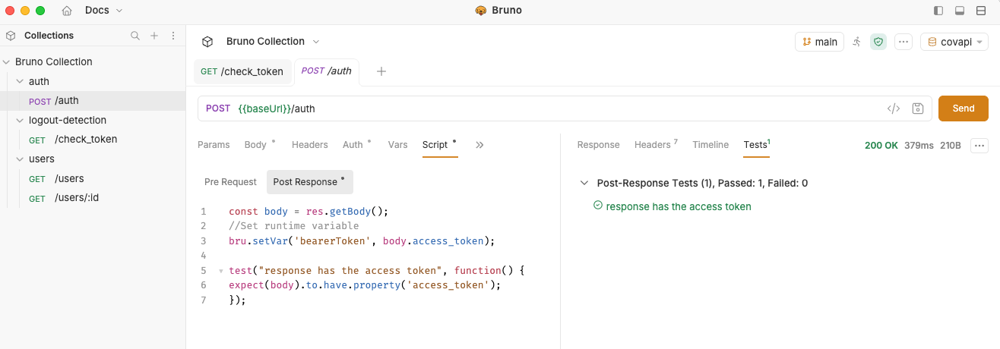
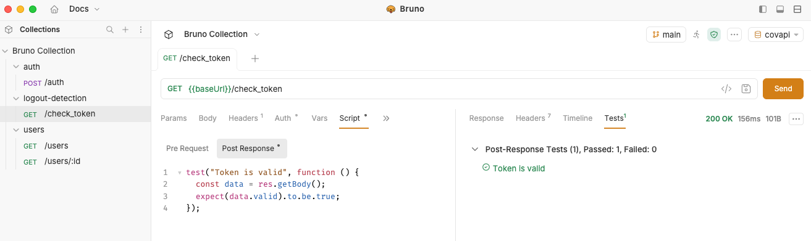

# Configure Bruno Collection Authentication

Configure authentication to scan an API using a Bruno collection.

Configure Snyk API & Web to run authenticated requests that use dynamically generated tokens (through a script). If scans take longer and your token expires, configure Snyk API & Web to detect logout and generate a new token.

## Example scenario

This guide uses a Bruno Collection example with the following requests:

1. **Authenticate and obtain an authentication token:** Requires a username and password in the request body.
2. **Get a list of users:** Requires the authentication token in the request header.
3. **Get user details:** Requires the authentication token in the request header and the user identifier as a parameter.
4. **Check token:** Requires the authentication token in the request header to validate the token

For configuring 1, 2 and 3, follow the example in [Configure an API target with a Bruno Collection](../configure-api-targets/configure-an-api-target-with-a-bruno-collection.md).

### Configure your Bruno collection for authentication

Create two top-level folders in your Bruno Collection, one for authentication and one for logout detection. Include test scripts to verify that authentication works and tokens remain valid:

1.  Add the authentication request to the `auth` folder and validate that the test passed.<br>

    <figure><figcaption></figcaption></figure>

    <div data-gb-custom-block data-tag="hint" data-style="info" class="hint hint-info"><p>Snyk API &#x26; Web uses the result of this test to notify you that the login failed and instruct the scanner to run the logout detection request.</p></div>
2.  Add the check token request to the `logout-detection` folder. Then navigate to the **Scripts** tab of the request and add the following test in the **Post Response** to validate that your token is still valid:<br>

    ```javascript
    test("Token is valid", function () {
    const data = res.getBody();
    expect(data.valid).to.be.true;
    });
    ```

    <figure><figcaption></figcaption></figure>

### Test and export the collection

After configuring all requests, run the collection to test it. If no issues occur, export the collection.

## Add or update your Bruno target

Add the Bruno target using the Bruno collection you exported. If your target is already configured in Snyk API & Web, update its schema:

1. Navigate to the **Targets** page.
2. Click the **gear icon** to access the target settings.
3. Select the **Scanner** tab and locate the **API SCANNING SETTINGS** section.
4. Upload the updated Bruno collection.
5. Save your changes and add the required environment variables.

## Configure Bruno target authentication

After configuring the Bruno environment values, configure your target's custom authentication:

1. Select the **Authentication** tab and locate the **API TARGET AUTHENTICATION** section.
2. Select the **AUTHENTICATION FOLDER**. After selection, the form updates to show the remaining fields.
3. Configure the authentication variables:
   1. **VARIABLE TYPE**: Select how the variable is scoped in your Bruno Collection. This must match how the variable is set in your collection's test script:
      * **Runtime**: For variables set with `bru.setVar()`
      * **Environment**: For variables set with `bru.setEnvVar()`
      * **Global**: For variables set with `bru.setGlobalEnvVar()`
   2. **VARIABLE NAME**: Select the name of the variable as defined in your test script (for example, `bearerToken`).
   3. **PLACE VARIABLE CONTENT IN**: Select where to send the variable content - **Header** or **Cookie**.
   4. **FIELD NAME**: Enter the name of the header or cookie field (for example, `Authorization`).
   5. **VALUE PREFIX**: Enter an optional prefix added before the variable value (for example, `Bearer`).
4. Click **Add Variable**. You can add multiple variables as needed.
5. Optionally, select the checkbox: **When login fails, fail the scan immediately and notify me**.
6. Click **Save** and ensure the authentication toggle is set to **On**.

## Configure Bruno logout detection (optional)

Adding logout detection helps Snyk API & Web to determine if the session ended, and try to authenticate again to proceed with the scan:

1. Locate the **LOGOUT DETECTION** section.
2. Select the folder from the schema file that contains the logout request. For our example scenario, you should select the `logout-detection` folder.

You turn authentication and logout detection on or off using the toggle buttons, or delete the configuration with the **Delete** button.
