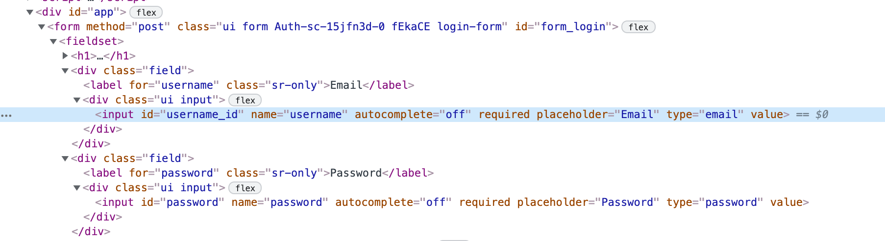

# Login form

Configure login form authentication to scan protected areas of your web application that require a username and password login.

Websites and applications can have restricted areas available only to authenticated users. Configuring authentication lets Snyk API & Web access these protected areas and identify vulnerabilities within the full scope of your target.

Create a dedicated user account for testing rather than using a real user account. Snyk submits forms and clicks buttons during scans, which can create unwanted data in the account.

## Prerequisites

* You must have added the target to Snyk API & Web
* Your application uses a standard HTML login form with username and password fields

## Navigate to login configuration

1. From the **Targets** page, locate your target in the list.
2. Click the **gear icon** to access the target settings.
3. Select the **Authentication** tab.
4. Click the **Login Form** button to display the configuration form.

## Add the login page URL

Specify the URL where the authentication process begins. In most cases, this is the page URL where you enter the credentials.

If you use Single Sign-On or need to visit a specific URL that redirects to the credentials page, specify that initial URL.

**Examples:**

* If your target's main page (`https://example.com/`) shows the form where credentials are entered, set the login form URL to `https://example.com/`
* If the path that shows the form is `/login`, set the login form URL to `https://example.com/login`
* If a specific path redirects to the login form when the user is not logged in:
  * `/` or `/login` redirects to `/login-page?redirectTo=%2Fdashboard`: Set the login form URL to `https://example.com/` or `https://example.com/login`
  * `/` or `/login` redirects to `https://auth0.example.com`: Set the login form URL to `https://example.com/` or `https://example.com/login`

## Configure field pairs

Add field name and value pairs for each input field in your login form.

### Add username or email field

1. Obtain the field name by right-clicking the field and selecting **Inspect**.
2. In the HTML, find the `name`, `id`, or CSS selector for the field.

<figure><figcaption></figcaption></figure>

For the example above, the field name could be any of:

* `username` (name attribute)
* `username_id` (id attribute)
* `form.login-form input[type="email"]` (CSS selector)
* `#username_id` (CSS selector using ID)

3. Enter the field name and the actual username or email address (for example, `admin@example.com` or `ExampleUser1`).
4. Click **Add**.

### Add password field

Repeat the process for the password field:

1. Inspect the password field to obtain its `name`, `id`, or CSS selector.
2. Enter the field name and the actual password value.
3. Click **Add**.

### Add additional fields (if needed)

If your login form requires additional fields beyond username and password, repeat this process for each field.

## Add submit button (optional)

In most cases, Snyk automatically detects and clicks the correct submit button. However, you might need to specify the submit button if:

* The submit button is outside the `<form>` tag
* The login inputs are not inside a `<form>` tag
* Your login form uses a non-standard structure

To specify the submit button:

1. Create a new field with the name `submit_button`.
2. In the value field, enter the CSS selector for the button (for example, `#login-form-container button[type="submit"]`).
3. Click **Add**.

## Save and enable

1. Review your configuration.
2. Click **Save and enable**.

You can disable or enable this authentication anytime using the **Off/On** toggle button, or delete the configuration using the **Delete** button.
