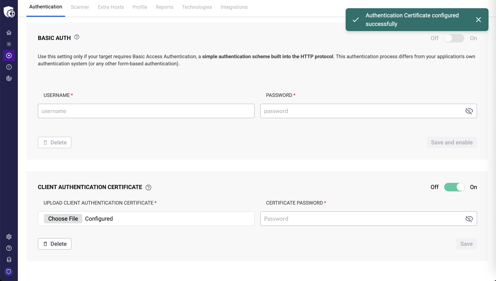

# Mutual TLS

Configure mutual TLS (mTLS) authentication for targets that require client-side certificates.

Unlike standard TLS, which authenticates only the server, mutual TLS is an enhanced security protocol where both the client and server authenticate using digital certificates.

## Prerequisites

* You must have the **change target settings** permission
* You must have your client authentication certificate (`.p12` or `.pfx` format)
* You must have the corresponding certificate password
* Your account plan must include this feature

## Upload the certificate

1. Navigate to the **Targets** page.
2. Click the **gear icon** to access the target settings.
3. Select the **Authentication** tab and locate the **Client Authentication Certificate** section.
4. Upload your `.p12` or `.pfx` certificate file.
5. Enter the **Certificate Password** required to decrypt the file.
6. Click **Save**.

## Verify the configuration

After you save the configuration, mutual TLS authentication is enabled. The next scan against this target automatically uses the configured mTLS certificates.

<figure><figcaption></figcaption></figure>

Important: For your security, Snyk obfuscates all sensitive fields (certificates and passwords) after saving. You cannot view or retrieve them again.

## Manage the configuration

You can manage these settings anytime from your target's **Authentication** tab:

* To temporarily disable the setting, use the **Off/On** toggle
* To permanently remove the configuration, use the **Delete** button
