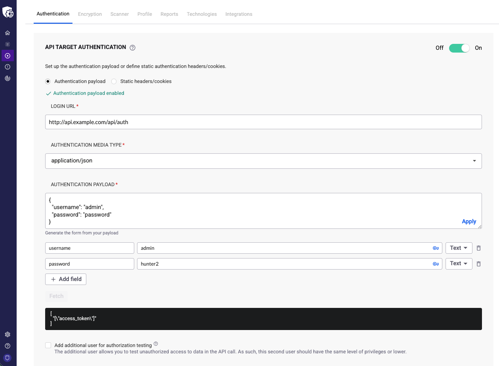
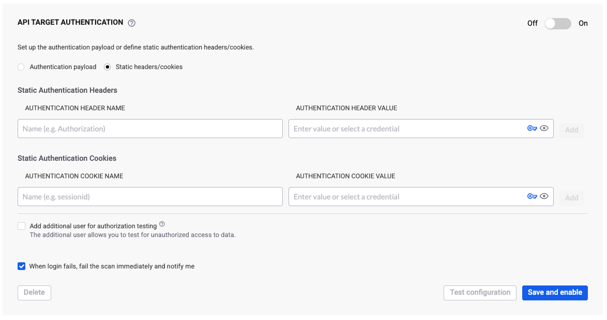

# OpenAPI authentication

Configure authentication to scan an API using an OpenAPI schema.

If you have an OpenAPI schema for an API with authentication, you can configure Snyk API & Web to run authenticated requests and scan the API endpoints.

After adding an API target, configure authentication using one of these scenarios:

* Authenticate with an API token in the request header
* Authenticate with a static header or cookie
* Authenticate with a fixed API key in a request parameter

## Authenticate with an API token in the request header

In this scenario, you obtain an API token from an endpoint that authenticates you with credentials, such as a username and password.

This authentication pattern is common on APIs that support web applications: the user authenticates with username and password, obtaining a token used in all subsequent requests.

1. Navigate to the **Targets** page and click the **gear icon** to access the target settings.
2. Select the **Authentication** tab and locate the **API TARGET AUTHENTICATION** section.

<figure><figcaption></figcaption></figure>

3. Configure the authentication:
   1. **AUTHENTICATION MEDIA TYPE**: Select the payload format for the authentication endpoint:
      * `application/json`: Key-value pairs in a JSON object
      * `application/x-www-form-urlencoded`: Key-value pairs separated by ampersands (for example, `username=admin&password=pass123`)
   2. **LOGIN URL**: Enter the authentication URL.
   3. **AUTHENTICATION PAYLOAD**: Enter the authentication content to send in the POST request payload to the login URL.
4. Click **Fetch** to authenticate. The **TOKEN SELECTOR** field populates with fields from the authentication response. If authentication fails, Snyk displays an error.
5. In the **TOKEN SELECTOR**, choose the field that contains the authentication token.
6. In **PLACE TOKEN IN**, choose where to place the token in API requests (usually **header**, but **cookie** is also available).
7. In **FIELD NAME**, enter the name of the field in the header or cookie that holds the token.
8. (Optional) Set a **VALUE PREFIX** for the token value. This is often needed for JWTs. For example, if your API requires a header like `Authorization: JWT <token>`, configure:
   * **FIELD NAME**: `Authorization`
   * **VALUE PREFIX**: `JWT`
9. Click **Save** and ensure the authentication toggle is set to **On**.


To test for Broken Object Level Authorization (BOLA) vulnerabilities, you can add an additional user for authorization testing. Visit [Set up your target for testing BOLA vulnerabilities](../../start-scanning/overview-scan-settings/test-bola-vulnerabilities.md) for details.


## Authenticate with a static header or cookie

In this scenario, you have a static header or cookie that must be present in all requests.

This is the simplest scenario. Add a custom header or cookie with the appropriate name and value:

1. Navigate to the **Targets** page and click the **gear icon** to access the target settings.
2. Select the **Authentication** tab and locate the **API TARGET AUTHENTICATION** section.
3. Select the **Static headers/cookies** option.
4. Configure a custom header or cookie name and value.
5. Click **Add**.

<figure><figcaption></figcaption></figure>

6. Click **Save** and ensure the authentication toggle is set to **On**.

You can turn API Target Authentication on or off anytime using the **Off/On** toggle button, or delete the configuration using the **Delete** button.

## Authenticate with a fixed API key in a request parameter

In this scenario, you have a fixed API key that must be placed in a specific parameter.

1. Navigate to the **Targets** page and click the **gear icon** to access the target settings.
2. Select the **Scanner** tab and locate the **API SCANNING SETTINGS** section.
3. In the **API PARAMETER CUSTOM VALUES** section:
   1. Enter the field name (for example, `token`).
   2. Enter the field value (your API key).
4. Click **Add** and **Save**.

You can add multiple entries if your API key location varies. For example, if you use `key` for GETs and `token` for POSTs, add both fields with the same value. Snyk API & Web uses the correct one for each endpoint.
