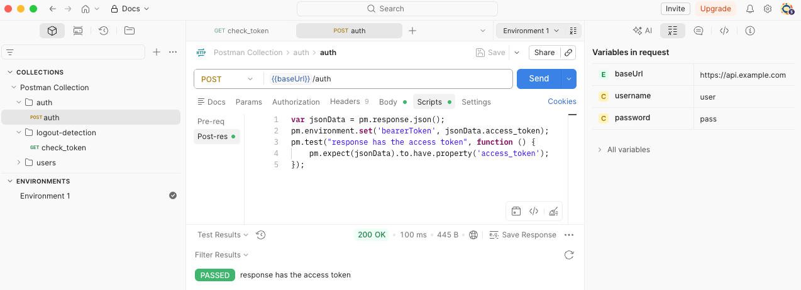
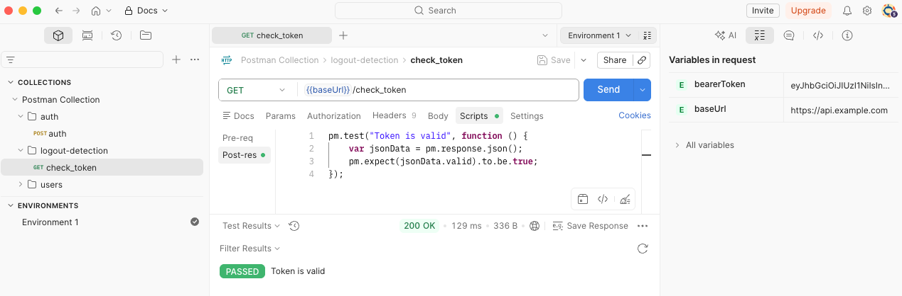

# Postman authentication

Configure authentication to scan an API using a Postman collection.

You can configure Snyk API & Web to run authenticated requests that use dynamically generated tokens through a script. For longer scans where your token expires, you can also configure Snyk to detect the logout and generate a new token.

## Example scenario

This guide uses a Postman Collection example with the following requests:

1. **Authenticate and obtain an authentication token** - requires a username and password in the request body.
2. **Get a list of users** - requires the authentication token in the request header.
3. **Get user details** - requires the authentication token in the request header and the user identifier as a parameter.
4. **Check token** - requires the authentication token in the request header to check if it is still valid.

To configure requests one, two, and three, follow the example in [Configure Postman Collection targets](../configure-api-targets/configure-postman-collection-targets.md).

## Configure your Postman collection for authentication

Create two top-level folders in your Postman Collection, one for authentication and one for logout detection. Include test scripts to verify that authentication works and tokens remain valid:

1.  Add the authentication request to the `auth` folder and validate that the test passed.

    <figure><figcaption></figcaption></figure>

    <div data-gb-custom-block data-tag="hint" data-style="info" class="hint hint-info"><p>Snyk API &#x26; Web uses the result of this test to notify you that the login failed and to instruct the scanner to run the logout detection request.</p></div>
2.  Add the check token request to the `logout-detection` folder. Then navigate to the **Scripts** tab of the request and add the following test in the **Post-response** to validate that your token is still valid:

    ```javascript
    pm.test("Token is valid", function () {
      var jsonData = pm.response.json();
      pm.expect(jsonData.valid).to.be.true;
    });
    ```

    <figure><figcaption></figcaption></figure>

### Test and export the collection

With all requests configured, run the collection to test it. If there are no issues, export the collection.

## Add or update your Postman target

Add the Postman target using the Postman collection you exported. If your target is already configured in Snyk API & Web, update its schema:

1. Navigate to the **Targets** page.
2. Click the **gear icon** to access the target settings.
3. Select the **Scanner** tab and locate the **API SCANNING SETTINGS** section.
4. Upload the Postman collection you obtained from the previous step.
5. Save your changes and add the required environment variables.

## Configure Postman target authentication

After configuring the Postman environment values, configure your target's authentication:

1. Select the **Authentication** tab and locate the **API TARGET AUTHENTICATION** section.
2. In the **FOLDER IN SCHEMA FILE** select the `auth` folder. After selection, the form updates to show the remaining fields.
3. Configure the authentication variables:
   1. **VARIABLE TYPE**: Select how the variable is scoped in your Postman Collection. This must match how the variable is set in your collection's test script:
      * **Environment**: For variables set with `pm.environment.set()`
      * **Globals**: For variables set with `pm.globals.set()`
   2. **VARIABLE NAME**: Select the name of the variable as defined in your test script (for example, `bearerToken`).
   3. **PLACE VARIABLE CONTENT IN**: Select where to send the variable content - **Header** or **Cookie**.
   4. **FIELD NAME**: Enter the name of the header or cookie field (for example, `Authorization`).
   5. **VALUE PREFIX**: Enter an optional prefix added before the variable value (for example, `Bearer`).
4. Click **Add Variable**. You can add multiple variables as needed.
5. Optionally, select the **When login fails, fail the scan immediately and notify me** checkbox.
6. Click **Save** and ensure the authentication toggle is set to **On**.

## Configure Postman logout detection (optional)

Logout detection helps Snyk determine if the session ended and authenticate again to continue the scan:

1. Locate the **LOGOUT DETECTION** section.
2. Select the folder from the schema file that contains the logout request. For this example scenario, select the `logout-detection` folder.

You can turn both the authentication and logout detection on or off anytime using the **Off/On** toggle button, or delete the configuration using the **Delete** button.
