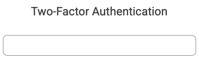
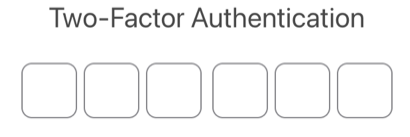
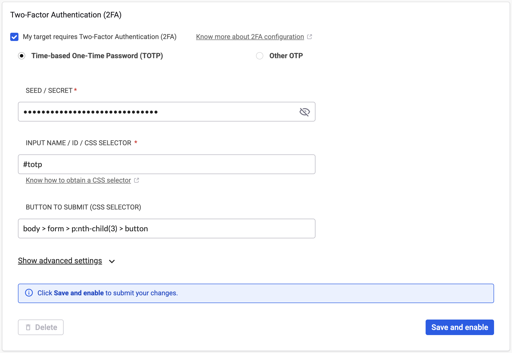
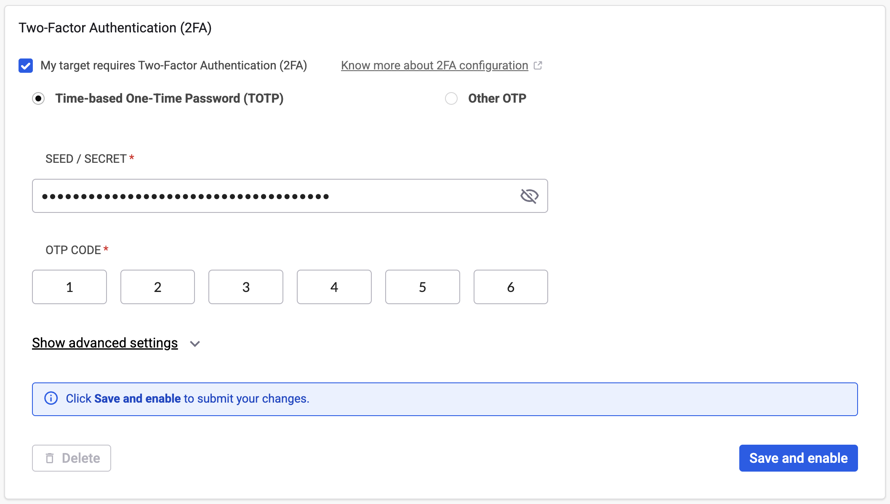
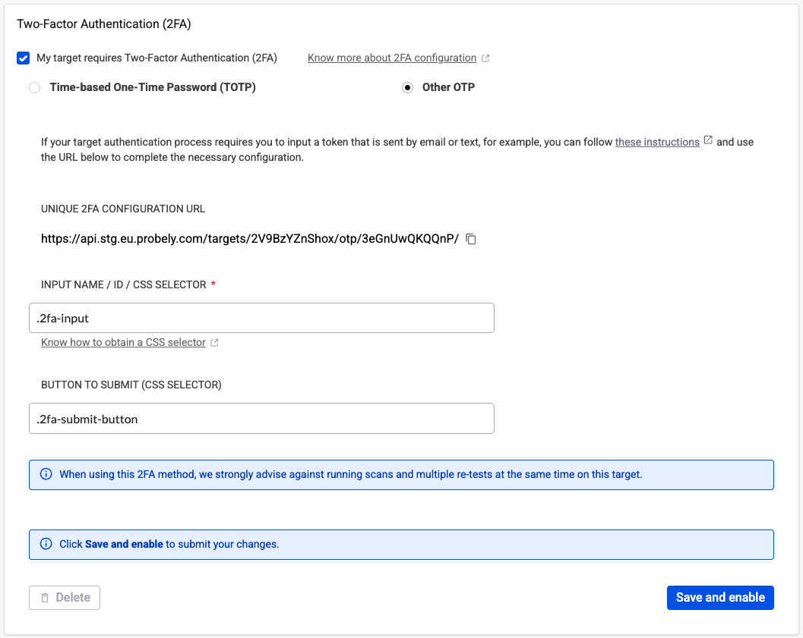
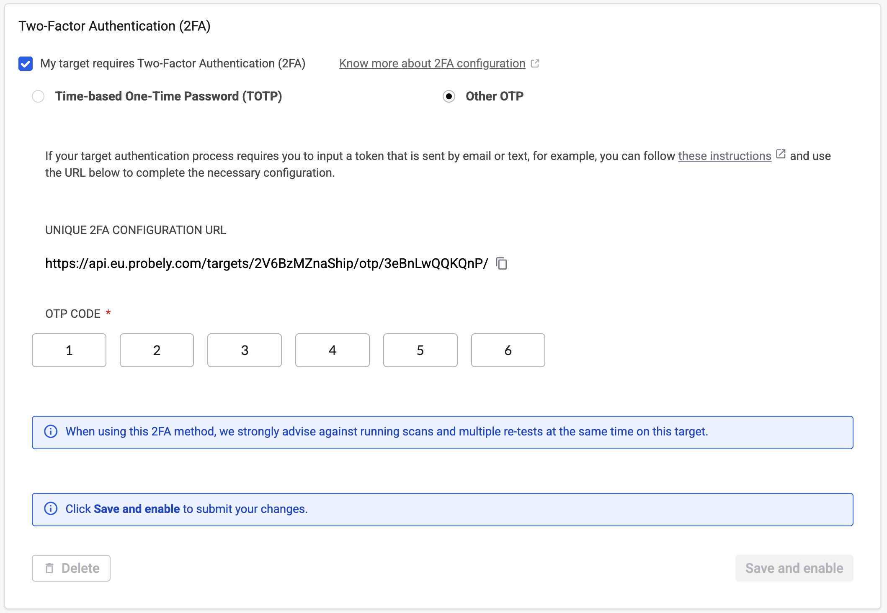
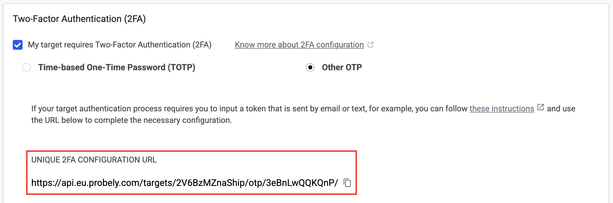

# Two-factor authentication

Configure two-factor authentication (2FA) to scan targets with an additional security layer beyond username and password.

Two-factor authentication strengthens authentication with an additional layer of security that requires presenting an extra piece of evidence (the possession factor) to the authentication mechanism of a website or application.

In Snyk API & Web, you can scan websites or applications that use 2FA by configuring it in the **Two-Factor Authentication (2FA)** section of your target settings.

## Prerequisites

Before configuring 2FA, you must first configure either Login Form or Login Sequence authentication:

* [Configure login form authentication](configure-login-form.md)
* [Configure login sequence authentication](configure-login-sequence.md)

Create a dedicated user account for testing rather than using a real user account. Snyk API & Web submits forms and clicks buttons during scans, which might create unwanted data in the account.

## Choose a 2FA method

Snyk API & Web supports two methods for 2FA:

* **Time-based One-Time Password (TOTP)**: Use this if your 2FA factor is obtained using an authenticator app like Google Authenticator, 1Password, Authy, or Microsoft Authenticator, which provides a random code that changes frequently.
* **Other OTP (One-Time Password)**: Use this if your 2FA factor is a random code sent through a communication channel like email or text message.

## Configure TOTP

TOTP uses an authenticator app on your phone to generate random codes that change frequently. The app requires a seed or secret to generate the codes that match what the server expects.

### Obtain the 2FA seed or secret

The seed or secret is obtained when the QR Code is displayed during 2FA setup.

Obtain the secret in one of these ways:

* The secret is available on the page together with the QR Code (for example, GitHub has a link to show the secret)
* Use a QR Code scanner app on your phone to scan the QR Code. The QR Code link contains the secret in it.

Example: `otpauth://totp/Example:joe@example.com?secret=JBSWY3DPEHPK3PXP&issuer=Example`

After scanning the QR Code with your authenticator app, it will start providing TOTP codes, allowing you to complete the 2FA configuration for the website or application.

### Configure TOTP with Login Form

When the 2FA form requests the TOTP code, obtain the following:

1. CSS selector for the TOTP input field: This selector depends on whether your site uses a single input field or multiple fields for the authenticator code.

*   Single input field:

    <figure><figcaption></figcaption></figure>

    *   In the following example, the CSS selector could be:

        * `#totp`

        ```html
        <div class="form-security-code">
           <div class="ui input">
              <input id="totp" class="form-security-code-input" type="tel">
        ```
*   Multiple input fields:

    <figure><figcaption></figcaption></figure>

    *   If your site has the form split into several input fields, configure this using multiple CSS selectors. In the following example, the CSS selector could be:

        * `split::#otp-digit-1::#otp-digit-2::#otp-digit-3::#otp-digit-4::#otp-digit-5::#otp-digit-6`

        ```html
        <div class="form-security-code">
        <div class="form-security-code-inputs">
           <input id="otp-digit-1" class="form-security-code-input" type="tel">
           <input id="otp-digit-2" class="form-security-code-input" type="tel">
           <input id="otp-digit-3" class="form-security-code-input" type="tel">
           <div class="form-security-code-divider"></div>
           <input id="otp-digit-4" class="form-security-code-input" type="tel">
           <input id="otp-digit-5" class="form-security-code-input" type="tel">
           <input id="otp-digit-6" class="form-security-code-input" type="tel">
        </div>
        </div>
        ```

2.  CSS selector for the submit button, for example:

    * `body > form > p:nth-child(3) > button`

    ```html
    <body>
       <form>
          <p><!-- First child --></p>
          <p><!-- Second child --></p>
          <p><!-- Third child -->
          <button type="submit">Submit</button>
          </p>
       </form>
    </body>
    ```

Then configure 2FA in Snyk API & Web as follows:

1. Navigate to the **Authentication** tab of the target settings.
2. Scroll down to the **Two-Factor Authentication (2FA)** section.
3. Enable the **My target requires Two-Factor Authentication (2FA)** checkbox.
4. Leave the default **Time-based One-Time Password (TOTP)** selected.
5. Enter the **Seed / Secret** obtained from the 2FA configuration.
6. Enter the two **CSS Selectors**:
   * CSS selector for the TOTP input field
   * CSS selector for the submit button
7. Click **Save and enable**.

<figure><figcaption></figcaption></figure>

### Configure TOTP with Login Sequence

To use the TOTP code in a login sequence, record a new login sequence with 2FA and update the target login sequence. Visit [Configure login sequence authentication](configure-login-sequence.md) for instructions. During the recording, take note of the TOTP code that you used because you will need it for the configuration.

Then configure configure 2FA in Snyk API & Web as follows:

1. Navigate to the **Authentication** tab of the target settings.
2. Scroll down to the **Two-Factor Authentication (2FA)** section.
3. Enable the **My target requires Two-Factor Authentication (2FA)** checkbox.
4. Leave the default **Time-based One-Time Password (TOTP)** selected.
5. Enter the **Seed / Secret** obtained from the 2FA configuration.
6. Enter the **OTP Code** (the code saved while recording the login sequence).
7. Click **Save and enable**.

<figure><figcaption></figcaption></figure>

## Configure alternative OTP

Alternative OTP sends a random code through a communication channel like email or text message. This code is entered during the login process to complete authentication.

### Configure OTP with Login Form

When the 2FA form requests the OTP code, obtain the following:

1. **CSS selector for the OTP input field**: This selector depends on whether your site uses a single input field or multiple fields for the authenticator code.
2. **CSS selector for the submit button**: For example, `.2fa-submit-button`.

Then configure configure 2FA in Snyk API & Web as follows:

1. Navigate to the **Authentication** tab of the target settings.
2. Scroll down to the **Two-Factor Authentication (2FA)** section.
3. Enable the **My target requires Two-Factor Authentication (2FA)** checkbox.
4. Select **Other OTP**.
5. Enter the two **CSS Selectors**:
   * CSS selector for the OTP input field
   * CSS selector for the submit button
6. Click **Save and enable**.

<figure><figcaption></figcaption></figure>

### Configure OTP with Login Sequence

To use the OTP code in a login sequence, record a new login sequence with 2FA and update the target login sequence. Visit [Configure login sequence authentication](configure-login-sequence.md) for instructions. During the recording, take note of the OTP code that you used because you will need it for the configuration.

Then configure 2FA in Snyk API & Web as follows:

1. Navigate to the **Authentication** tab of the target settings.
2. Scroll down to the **Two-Factor Authentication (2FA)** section.
3. Enable the **My target requires Two-Factor Authentication (2FA)** checkbox.
4. Select **Other OTP**.
5. Enter the **OTP Code** (the code saved while recording the login sequence).
6. Click **Save and enable**.

<figure><figcaption></figcaption></figure>

### Communicate OTP to Snyk API & Web

With 2FA configured on the target settings, you need to implement communication of the OTP to Snyk API & Web when your 2FA requests it. Send the OTP by calling an endpoint from the Snyk API & Web API where you send the OTP in the request body.

Curl example:

```bash
curl -X POST '<UNIQUE 2FA CONFIGURATION URL>' \
-H 'Content-type: application/json' \
-d '{"otp": "<OTP>"}'
```

Where:

* **\<UNIQUE 2FA CONFIGURATION URL>** is the URL provided under **Unique 2FA Configuration URL** in your target settings.

<figure><figcaption></figcaption></figure>

* **\<OTP>** is the OTP to send to Snyk API & Web to authenticate in your 2FA.

### Automate OTP extraction

For automated OTP extraction and submission, see [Automate OTP extraction](automate-otp-extraction.md) for examples using:

* Google Apps Script
* Microsoft Power Automate

## Related content

* [Configure login form authentication](configure-login-form.md)
* [Configure login sequence authentication](configure-login-sequence.md)
* [Automate OTP extraction](automate-otp-extraction.md)
