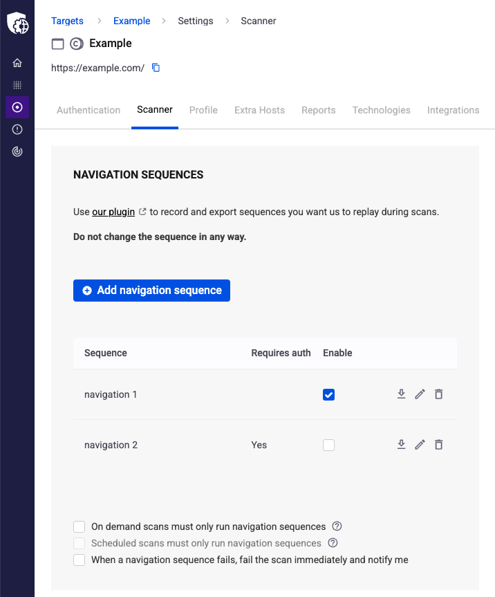

# Use navigation sequences

Guide the scanner to specific application states and complex areas of your web application using navigation sequences.

## What are navigation sequences?

Navigation sequences are recorded sets of actions that the scanner replays during scans to reach specific areas of your application. Use navigation sequences when your web application has complex workflows, multi-step processes, or sections that require specific user interactions to access.

For example, if your application has a shopping cart flow, admin panels, or dynamic content that only appears after specific user actions, record those steps as a navigation sequence to ensure the scanner tests those areas.

## Record a navigation sequence

Before configuring a navigation sequence in Snyk API & Web, you need to record it using the Snyk API & Web Sequence Recorder browser plugin.

Visit the [Use sequence recorder](use-sequence-recorder.md) article for detailed instructions on installing the plugin and recording sequences.

When recording a navigation sequence:

* If your sequence requires authentication, ensure you are **logged in** to your target before starting the recording
* Perform each step carefully, clicking links and buttons as a user would
* Avoid unnecessary actions that are not part of the workflow you want the scanner to follow

## Add a navigation sequence

After recording a navigation sequence, add it to your target configuration:

1. Navigate to your target settings and locate the **Navigation Sequences** section in the **Scanner** tab.
2. Click **Add Navigation Sequence**. On the import screen:
   * Define a name for your sequence
   * Paste or upload the previously recorded navigation sequence
   * If your sequence requires authentication, select the **Requires authentication** option
3. Submit your sequence.

## Verify navigation sequences

After adding a navigation sequence, Snyk API & Web displays it in the Navigation Sequences list. The scanner replays this sequence during target scans to reach and test the specified areas of your application.

<figure><figcaption></figcaption></figure>

Run a scan to verify the navigation sequence works correctly and allows the scanner to reach the intended areas of your application.
