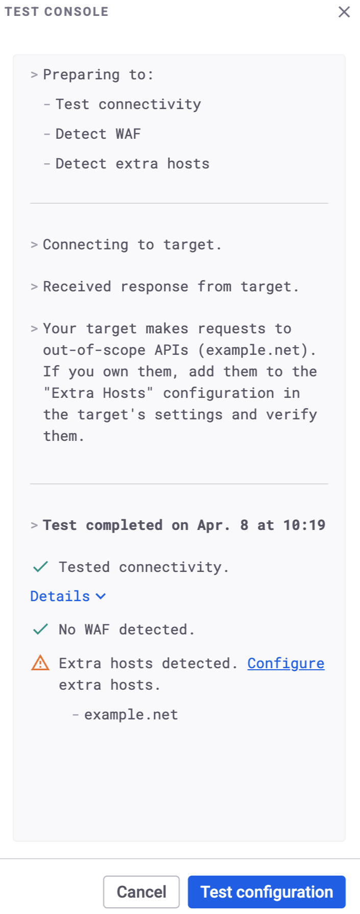
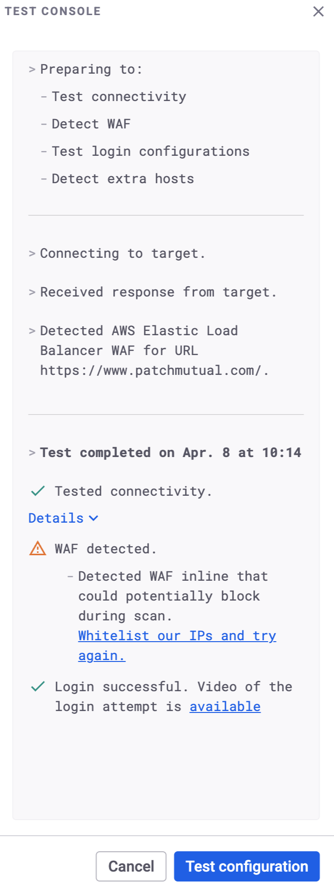

# Test target configuration

Test your target configuration before running a scan to avoid common issues that lead to failed scans or incomplete results.

Testing configuration allows you to:

* Confirm Snyk API & Web can access your target.
* Verify login credentials work as expected.
* Identify if a web application firewall (WAF) or other security measures block traffic.
* Verify the validity of your API schema or collection.
* Discover extra hosts that might need to be added to your target.

## Prerequisites

To test target configuration, you must have these permissions:

* `view_target`
* `change_target_settings`
* `start_scan`

## Test configuration from the Targets list

1. Navigate to **Targets** and locate the target to test.
2. Open the **Scan** button dropdown.
3. Select **Test configuration**.

## Test configuration from Target settings

1. Navigate to the target settings page.
2. Click **Test configuration** in the **Login Configuration** or **API Target Authentication** module, or at the top of the page.

## Review test results

After starting the test, a side panel opens to display test progress in real time.

Snyk API & Web provides feedback on these areas:

* **Connectivity**: Confirms Snyk API & Web can reach the URL
* **WAF Detection**: Alerts if a firewall might interfere with the DAST scan
* **Authentication**: Validates that credentials successfully grant access to the target
* **Schema Validity**: Verifies the schema provided for API targets
* **Extra Hosts**: Identifies additional domains the web application relies on that might need to be added to target settings

If a check fails or requires further configuration, the side panel provides a call to action to help resolve the issue. You can also review connectivity details and, if applicable, a video of the login attempt.

Examples:

<figure><figcaption></figcaption></figure>

|

<figure><figcaption></figcaption></figure>

\---|---
