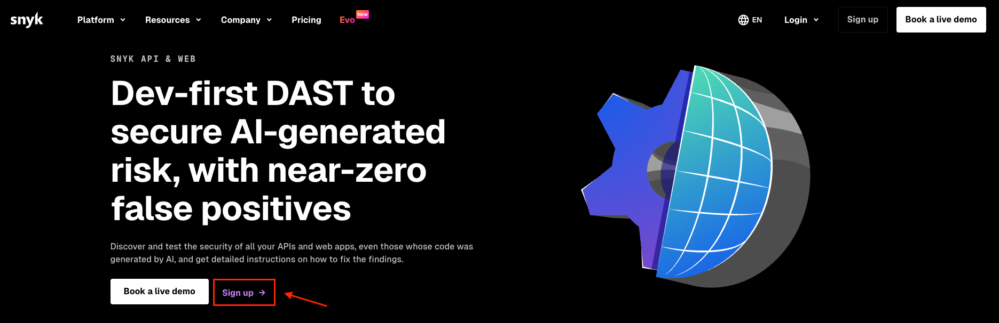
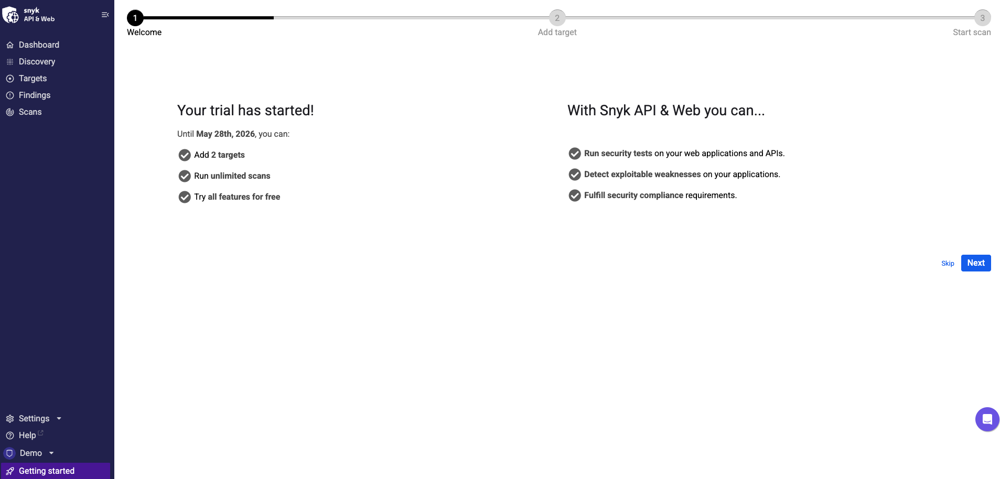
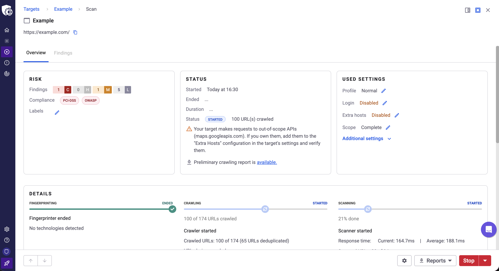
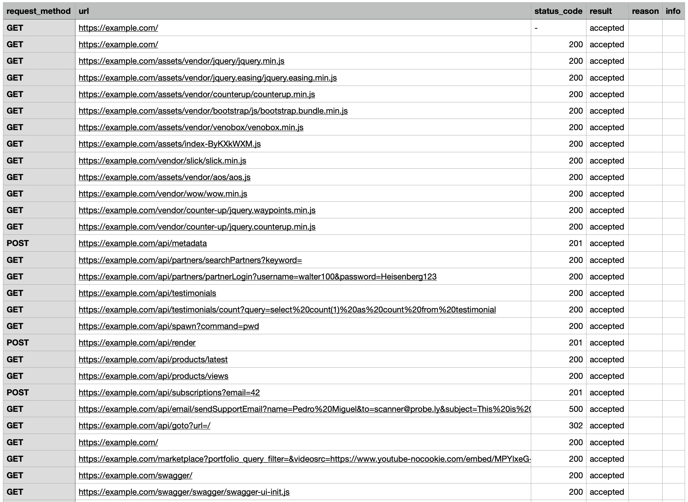
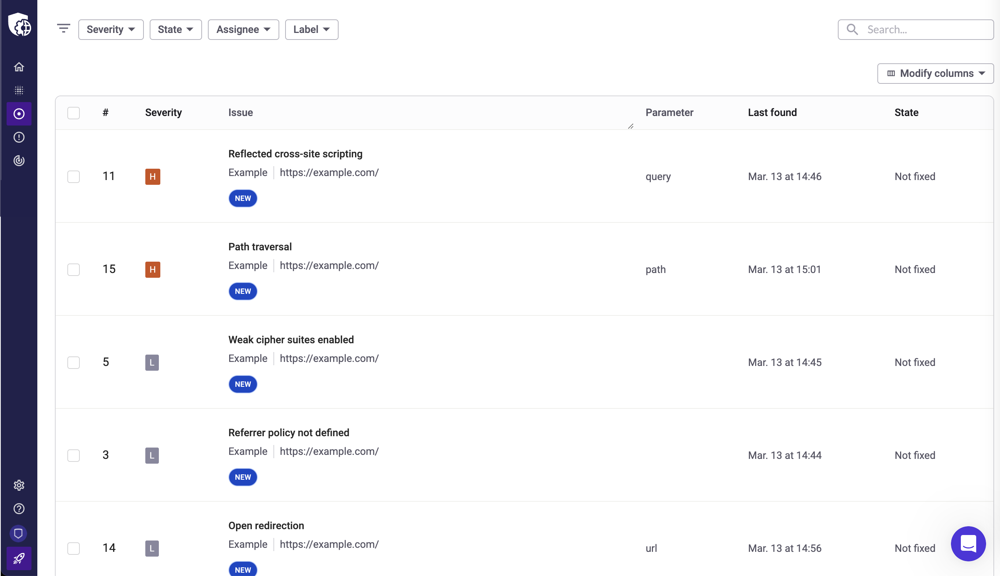
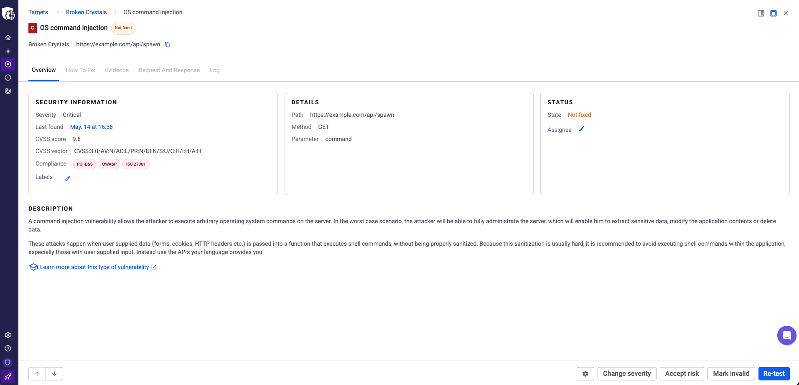

# Getting started with Snyk API & Web

Learn how to start scanning web applications for security vulnerabilities using Snyk API & Web.

## Overview

This guide walks you through the essential steps to begin using Snyk API & Web for security scanning:

1. Sign up for Snyk API & Web
2. Complete the onboarding flow
3. Review scan coverage
4. Analyze findings

## Sign up for Snyk API & Web

Create your account in Snyk API & Web to start scanning:

1.  Navigate to [https://snyk.io/product/dast-api-web/](https://snyk.io/product/dast-api-web/) and click **Sign up**.

    <figure><figcaption></figcaption></figure>
2. Enter your email address and click **Submit**.
3. Check your email for a verification message and click **Verify email**.
4. Complete the registration form and click **Create account**.

## Complete the onboarding flow

After creating your account, Snyk displays [best practices for deploying dynamic application security testing (DAST)](best-practices-for-deploying-dast.md) and guides you through the initial setup:

1.  Click **Next** to begin.

    <figure><figcaption></figcaption></figure>
2. Select **My own target** and click **Next**.
3. Select **Web** as the target type and click **Next**.
4. Add your first target:
   * **Target name**: Enter a descriptive name (for example, "Example")
   * **Target URL**: Enter the URL to scan (for example, `https://example.com`)
5. When you add a target, Snyk verifies that you own the domain. Snyk performs extensive security tests that can appear as malicious attacks. Domain verification proves that you own the domain and are authorized to run security tests.
   1. The onboarding flow automatically verifies ownership when possible. If automatic verification is not available, you must prove ownership manually through the guided process. Alternatively, you can install a scanning agent to reach internal targets. For more information, see how to [verify domain ownership](../configure-targets/verify-domain-ownership/README.md) and [how to install a scanning agent](../start-scanning/overview-scanning-agent/install-scanning-agent.md).
6. Click **Next** after configuring domain verification or the scanning agent.
7. Click **Scan** to start scanning your target.
8. A success page confirms that your scan started.

## Review scan coverage

The **Scan Overview** page shows the progress of your scan.

<figure><figcaption></figcaption></figure>

While the scan runs, you can download the preliminary crawling report to review coverage so far. Then, after the scan completes, download the full crawling report.

The **crawling report** shows URLs discovered and tested, HTTP request method, and HTTP response codes for each URL.

<figure><figcaption></figcaption></figure>

Use this information to verify that the scanner reached all intended parts of your application and identify any access issues.

## Analyze findings

The **Scan Findings** page displays all security vulnerabilities identified during the scan.

<figure><figcaption></figcaption></figure>

Click a finding in the findings list to view its CVSS score, vulnerability description, remediation guidance, and additional context.

<figure><figcaption></figcaption></figure>

This information helps you understand the severity and impact of each vulnerability so you can prioritize and plan remediation work.

## Next steps

You can now scan applications, identify vulnerabilities, and plan security improvements.

To learn more:

* Review [best practices for deploying DAST](best-practices-for-deploying-dast.md)
* Understand [when you can scan a production site](can-i-scan-a-production-site.md)
* Understand [what is a target](../configure-targets/what-is-a-target.md)
* Learn [how to configure and scan an API](../configure-targets/configure-api-targets/)
* Explore [how to configure authentication](../configure-targets/configure-authentication/)
