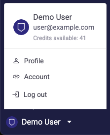
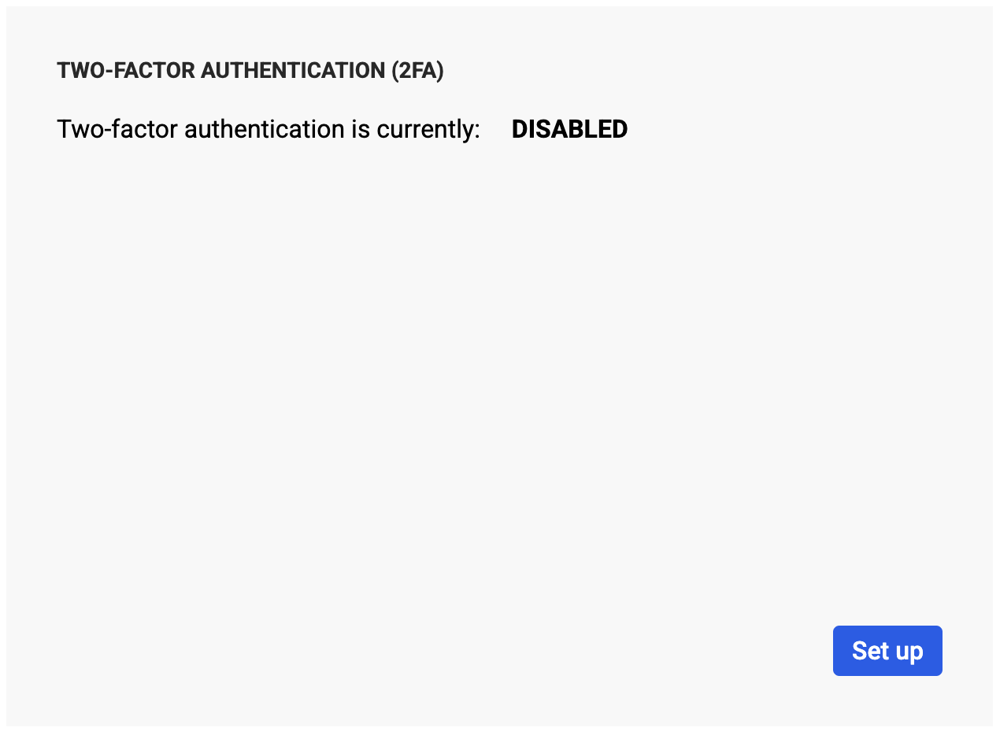
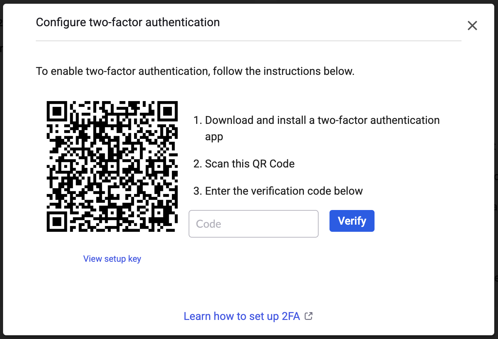
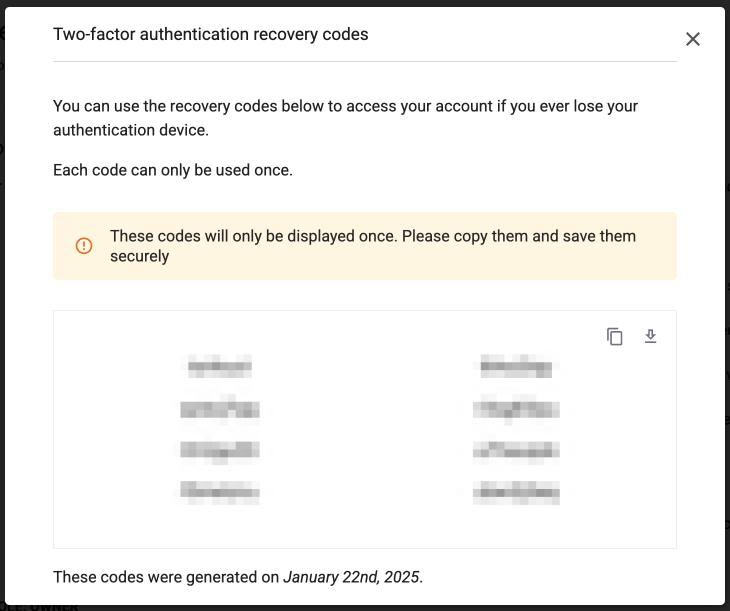
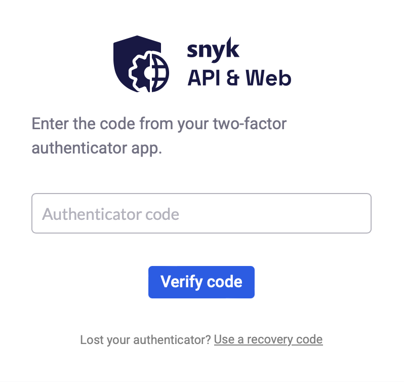
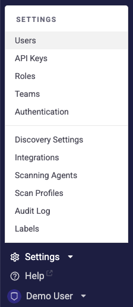
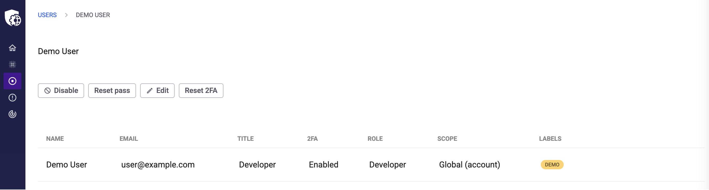

# Set up two-factor authentication

Learn how to set up two-factor authentication (2FA) for your profile and recover access if you lose your device.

Two-factor authentication (2FA) strengthens authentication with an additional layer of security that requires presenting an extra piece of evidence (the possession factor) to an authentication mechanism. To obtain the possession factor, you can use an authenticator like Google Authenticator, 1Password, Authy, or Microsoft Authenticator, which provides a random code that changes frequently.

In Snyk API & Web, users can set up 2FA by configuring this extra layer of authentication in their profiles.

## Set up 2FA for your profile

To set up 2FA in the Snyk API & Web app:

1. Open the dropdown menu with your username on the bottom-left corner of the navigation bar and click **Profile**.

<figure><figcaption></figcaption></figure>

2. In the **Two-factor authentication (2FA)** section, click **Set up**.

<figure><figcaption></figcaption></figure>

3. Enter your password as a security measure in the dialog that appears.
4. In the next dialog, follow the instructions:

<figure><figcaption></figcaption></figure>

1. Use your device to download and install a 2FA app (Google Authenticator, 1Password, Authy, Microsoft Authenticator, and so on) to provide a verification code.
2. Use the app to scan the QR Code.
3. Enter the verification code given by the app.
4. Click **Verify**.
5. 2FA is now enabled. Snyk API & Web shows a dialog with recovery codes in case you lose your device. Copy the codes, save them in a secure place, and close the dialog.

<figure><figcaption></figcaption></figure>

With 2FA set up and enabled, every time you log in to Snyk API & Web, you have a second authentication step asking you to enter the random code generated by the authenticator app installed on your device.

<figure><figcaption></figcaption></figure>

You can go to your profile and disable 2FA or update the device with the authentication app anytime. The procedure to update is similar to the setup process.

## Recover access to your account

When you have 2FA set up and enabled for your profile, you must have a device with the authenticator app to obtain the random code needed to log in to Snyk API & Web.

<figure><figcaption></figcaption></figure>

If you lose access to the device and cannot obtain the code, you have several options:

1. Use a recovery code from the ones provided by Snyk API & Web during your 2FA account setup.
2. Reset your 2FA with the help of the Snyk API & Web account owner.
3. Contact the Snyk API & Web support team.

### Option 1: Use a recovery code

While setting up 2FA for your account, Snyk API & Web provides a set of recovery codes. If you have access to them:

1. Pick one code you never used before (each code can only be used once).
2. Type the code in the 2FA dialog to complete the authentication.

You are now logged in to Snyk API & Web. You can go to your profile and, in the **Two-factor authentication (2FA)** section, click **Update** to replace the device. The procedure is similar to steps four and five in the setup process.

### Option 2: Reset your 2FA

If you can reach out to the owner of your Snyk API & Web account, they can reset your 2FA and disable it for you.

The account owner must:

1. Open the **Settings** dropdown menu on the bottom-left corner of the navigation bar and click **Users**.

<figure><figcaption></figcaption></figure>

2. On the Users screen, click the line of your user to edit it.
3. On the User edit screen, click **Reset 2FA** and confirm.

<figure><figcaption></figcaption></figure>

Now, 2FA is disabled for your profile. You can log in without the second authentication step and set up 2FA again with a new device.

### Option 3: Contact support

If you cannot use a recovery code and the account owner is not available to reset your 2FA, contact the Snyk API & Web support team for assistance.

## Related information

* [Enforce 2FA for all users](enforce-2fa-for-all-users.md)
* [Add users](add-users.md)
* [Roles and permissions](roles-and-permissions.md)
