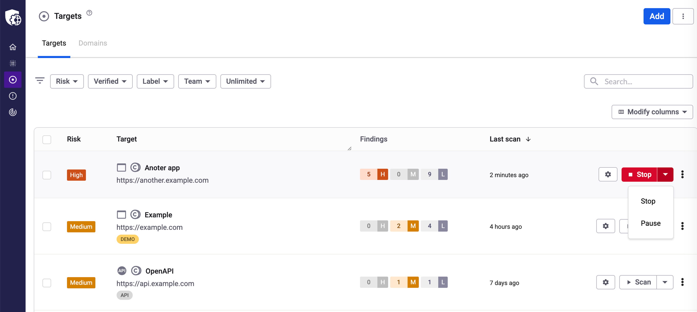

# Pause scans

You can pause and resume scans on demand and automatically using blackout periods.

## Pause and resume a scan on demand

To pause an ongoing scan:

1.  Click the caret icon within the **Stop** button to open the options menu, and select **Pause** for any ongoing scan.

    <figure><figcaption></figcaption></figure>
2. You can pause a scan from various pages:
   * List of targets
   * Target page
   * Scan results page
   * List of scans
3. Alternatively, you can pause a scan by calling the API.
4. After you pause a scan, Snyk API & Web stops crawling or scanning your site. Pausing a scan takes a while, and its status changes to **Pausing**.

## Stop a paused scan

You can **Stop** a paused scan, or **Resume** and pick up from where it left off.

If a paused scan is not resumed in the next seven days, Snyk automatically stops (cancels) it. Snyk notifies and reminds you to resume a scan you paused on demand.

## Blackout period: pause and resume scans automatically

Besides pausing and resuming scans on demand, you can also set up a blackout period (timeframe), that prevents new scans from starting and automatically pauses ongoing scans.

To set a blackout period:

1. Navigate to the **Targets** page and click the **gear icon** to access the target settings.
2. Select the **Scanner** tab and locate the **SCANNING BLACKOUT PERIOD** section.
3. Set start and end times when you want scans to be paused and resumed.
4. Select the day or days of the week to apply that schedule.
5. Save your settings.

For example, you can configure scans to run only from 6:00 AM–11:00 PM each day, pausing them overnight and resuming the next morning.
