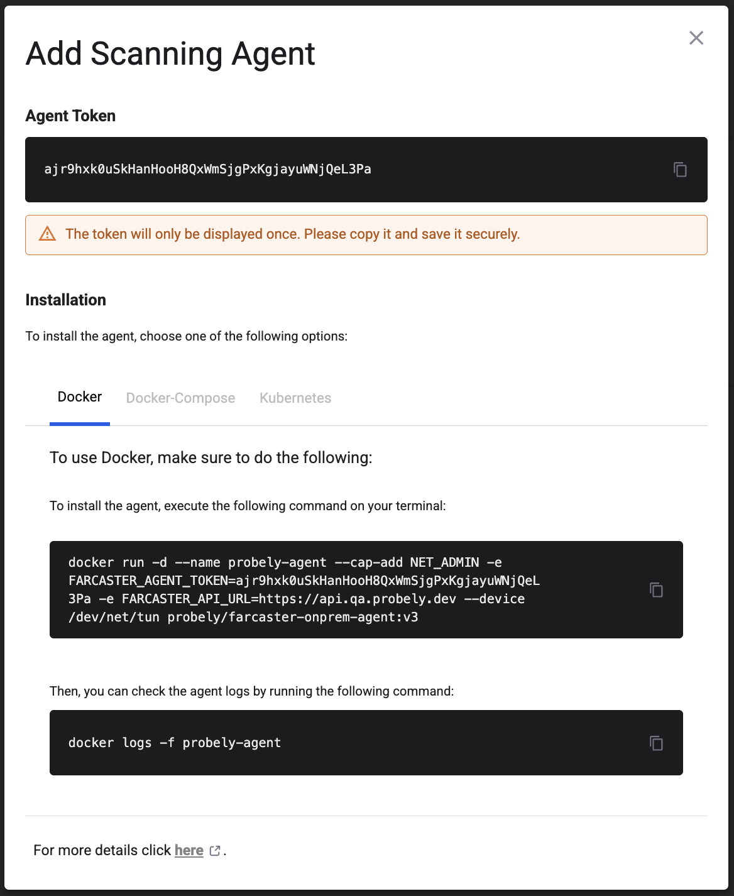

# Install a scanning agent

Install a Scanning Agent to scan your internal applications with minimal changes to network and security configurations.

The Scanning Agent lets you scan internal applications without exposing them to the internet. For more information about how the Scanning Agent works, visit [Scan internal applications with a Scanning Agent](scan-internal-applications.md).

Installing the Scanning Agent involves the following steps:

1. Create the Scanning Agent Token in your Snyk API & Web account.
2. Install the Scanning Agent on your network.

## Prerequisites

Ensure you have the following before you begin:

* An active Snyk API & Web account with permissions to create Scanning Agents.
* The minimal system resources and specific network requirements listed in the [Farcaster Agent GitHub Repository README](https://github.com/Probely/farcaster-onprem-agent/blob/main/README.md).

## Create the Scanning Agent Token

To create the Scanning Agent Token in your Snyk API & Web account:

1. Open the **Settings** dropdown menu in the bottom-left corner of the navigation bar and select **Scanning Agents**. If you cannot see this option, contact your account owner.
2. Click **Add Agent**.
   1. Type the name of the Scanning Agent.
   2. If the Scanning Agent is restricted to targets of some teams, select the check box and choose those teams from the dropdown.
3. Click **Generate**.

<figure><figcaption></figcaption></figure>

1. A pop-up window displays important information that, for security reasons, does not appear again. Do the following:
   * Under **AGENT TOKEN**, copy and save the token securely.
   * Under **Installation**, navigate to the tabs for the way you want to install the agent:
     * **DOCKER** - To use Docker, copy and save securely the following:
       1. The Docker command to install the agent.
       2. The Docker command to check the agent logs.
     * **DOCKER-COMPOSE** - To use Docker-compose, copy and save securely the following:
       1. The docker-compose.yml manifest for the agent.
       2. The Docker-compose command to start the agent.
     * **KUBERNETES** - To use Kubernetes, copy and save securely the following:
       1. The Kubernetes command to create the Snyk API & Web namespace.
       2. The Kubernetes command to create the agent token secret.
       3. The Kubernetes command to deploy the agent pod.

## Install the Scanning Agent on your network

After creating the token, install the Snyk API & Web Scanning Agent on your network. The Scanning Agent, also known as the _Farcaster Agent_, is open source and available on the official [Farcaster Agent GitHub repository](https://github.com/Probely/farcaster-onprem-agent/?tab=readme-ov-file#installation).

You can install the agent using Docker, Docker-Compose, Kubernetes, Windows, or Linux. For detailed instructions on how to install the agent, follow the [installation guidance](https://github.com/Probely/farcaster-onprem-agent/blob/main/README.md#installation) in the GitHub repository.

### Example: Install the agent using Docker on Linux

Before installing the agent container on a Linux system, you can check that your host can run it by running the following command:

```bash
curl -LO https://raw.githubusercontent.com/Probely/farcaster-onprem-agent/main/farconn/host-check.sh
chmod +x host-check.sh
./host-check.sh
```

Verify that the checks succeeded:

```
Checking if Docker is installed...                              [ok]
Launching test container...                                     [ok]
```

1. Use the Docker command from the token creation step to install the agent.
   1. Depending on your network configuration, you might need to set additional environment variables. See the list of [configuration options](https://github.com/Probely/farcaster-onprem-agent/blob/main/README.md#configuration-options) in the GitHub repository.
2. After starting the agent, it connects to Snyk API & Web. Run the command you saved from the token creation step to check that the agent connected successfully:

```bash
docker logs -f probely-agent
```

If everything is running correctly, you see output similar to:

```
Downloading agent configuration ... done
Deploying agent configuration   ... done
Starting local DNS resolver     ... done
Setting HTTP proxy rules        ... done
Connecting to Probely (via UDP) ... done
Setting local gateway rules     ... done
Starting WireGuard gateway      ... done

Running...
```

After the agent is up and running, you can set the Scanning Agent in your targets as described in [Scan internal applications with a Scanning Agent](scan-internal-applications.md), and run scans on those targets to scan your internal applications.

## Troubleshooting

If you have issues downloading the agent configuration, are unable to connect, have proxy configuration issues, or experience performance issues, check the [troubleshooting guidance](https://github.com/Probely/farcaster-onprem-agent/blob/main/README.md#troubleshooting) in the GitHub repository.
