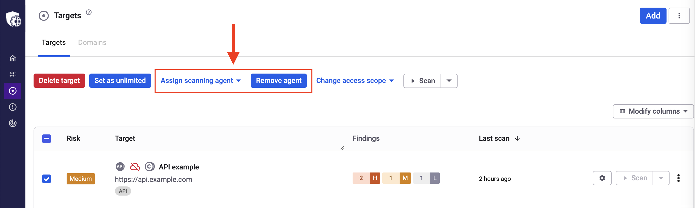

# Scan internal applications

Scan your internal applications with the Snyk API & Web Scanning Agent, a secure, clean, and straightforward solution to scan non-public applications.

## What is a Scanning Agent for?

The Snyk Scanning Agent lets you scan internal applications for vulnerabilities without exposing them to the internet or even to Snyk IP addresses. It is the ideal approach to scan any application that is only reachable from within your network, including development, staging, pre-release, and internal production applications that support your business.

You can use a single Scanning Agent to scan multiple internal targets, but you can also have different Scanning Agents, each one reaching a part of your network. There is no need for a single Scanning Agent to connect to the whole network.

## How does a Scanning Agent work?

A Scanning Agent creates an encrypted and authenticated tunnel where traffic flows securely between Snyk API & Web and your network.

To ensure Snyk meets your security expectations, Snyk follows these principles:

* All code is open source and [publicly available](https://github.com/Probely/farcaster-onprem-agent/).
* You have complete control over the Scanning Agent, including the right to change it.
* Snyk API & Web cannot access the Scanning Agent.
* The Scanning Agent runs in containers with the least required privileges.
* All traffic is encrypted end-to-end.
* The Scanning Agent does not open any network port.

## Install a Scanning Agent

To install a Scanning Agent, refer to [Install a Scanning Agent](install-scanning-agent.md) and the installation reference and source code for the installer available in the [Snyk API & Web GitHub repositories](https://github.com/Probely/farcaster-onprem-agent/).

## Scan a target with a Scanning Agent

When a Scanning Agent is configured and running, you must choose which targets use it:

1. In Snyk API & Web, navigate to the **Targets** menu.
2. Identify the target in the list for which you want to set the Scanning Agent and click the **gear icon** to open its settings.
3. Under the **Scanner** tab, navigate to the **SCANNING AGENT** section and select the Scanning Agent you want to use.
4. Click **Save**.

Click **Unlink** to remove the Scanning Agent for the target.

You can also assign or remove a Scanning Agent to or from multiple targets in the targets list. Select the targets you want to configure, and the options appear.

<figure><figcaption></figcaption></figure>

Targets configured to use a Scanning Agent show a cloud icon.

## Scanning Agent status

A Scanning Agent can have one of the following statuses:

| Status                | Description                                                                                                                                                                                                                                                                                                                                                                                                                                                 |
| --------------------- | ----------------------------------------------------------------------------------------------------------------------------------------------------------------------------------------------------------------------------------------------------------------------------------------------------------------------------------------------------------------------------------------------------------------------------------------------------------- |
| Connected             | The scanning agent is connected. It was working in the last 180 seconds.                                                                                                                                                                                                                                                                                                                                                                                    |
| Connected with issues | The scanning agent is connected, but it can have poor network performance if it uses, for example, an HTTP proxy or a direct TCP connection to Snyk API & Web. For more information, visit the [TCP Meltdown](https://web.archive.org/web/20220103191127/http://sites.inka.de/bigred/devel/tcp-tcp.html) problem and check the documentation on [launching the agent](https://github.com/Probely/farcaster-onprem-agent?tab=readme-ov-file#launch-the-agent). |
| Disconnected          | The scanning agent is disconnected, possibly due to misconfiguration. Check the scanning agent configuration or the firewall rules, for example. For more information, check the [Installation](https://github.com/Probely/farcaster-onprem-agent?tab=readme-ov-file#installation) and [Network Requirements](https://github.com/Probely/farcaster-onprem-agent?tab=readme-ov-file#network-requirements) documentation.                                        |
