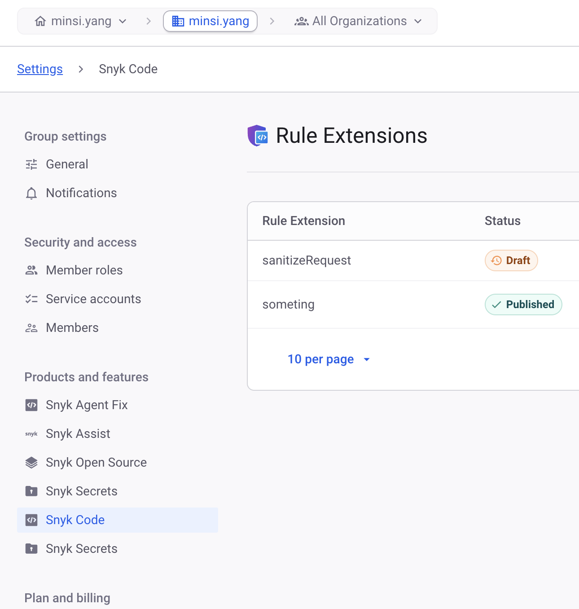
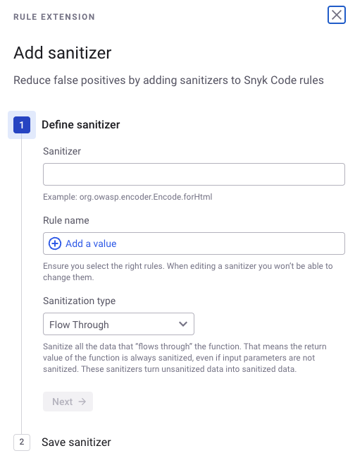

# Configure Rule Extensions

Rule Extensions are managed at the **Group** level in the Snyk Web UI, under **Group settings → Snyk Code**. You need the [UI access permissions](rule-extensions-permissions.md#permissions-for-ui-access) to reach these screens.

<figure><figcaption>Rule Extensions in Group settings → Snyk Code</figcaption></figure>

## Create a Rule Extension

Add a custom sanitizer to an existing Snyk Code rule.

1. Log in to the Snyk Web UI and select your [Group](https://docs.snyk.io/snyk-admin/groups-and-organizations).
2. Navigate to **Group settings → Snyk Code → Rule Extensions**.
3.  Click **Create sanitizer** and define the functional attributes:

    1. **Sanitizer**: Provide the fully qualified name (FQN). Need help identifying your FQN? See the [FQN identification guide](identify-your-sanitizers-fqn.md).
    2. **Rule key**: Select one or more rules you want this extension to apply to. This is the rule key specified on the [Supported rules](supported-rules.md) page.
    3. **Sanitization type**: Select one of the four ways your function sanitizes data. For more details, see [Custom sanitizers](custom-sanitizers.md).

    <figure><figcaption>
Add sanitizer as a rule extension in Snyk Code
</figcaption></figure>
4. Define the rule extension outline attributes:
   1. **Scope**: Choose whether to apply the rule extension to the entire Group or to a subset of Organizations within the Group.
   2. **Description** (Optional): Add a short description of what the rule extension does.
   3. **Status**: Specifies how the rule extension is treated after you save it:
      * **Published**: The rule extension is live; Snyk applies it starting with the next test.
      * **Draft**: Snyk excludes the Rule Extension from tests after you save it. Use this when collaborating with others for review. Once review is complete, change the status to publish it.
5. Click **Save**.

## Update a Rule Extension

You can update attributes such as sanitization type, scope, description, or status. The sanitizer, the rule selections, and the Rule Extension name are not editable.

1. Log in to the Snyk Web UI and select your [Group](https://docs.snyk.io/snyk-admin/groups-and-organizations).
2. Navigate to **Rule Extensions**.
3. Select the horizontal ellipsis and then select **Edit**.
4. Click **Save**.

## Delete a Rule Extension

After you delete a Rule Extension, tests no longer pick it up.

1. Log in to the Snyk Web UI and select your [Group](https://docs.snyk.io/snyk-admin/groups-and-organizations).
2. Navigate to **Rule Extensions**.
3. Select the horizontal ellipsis and then select **Delete**.
4. Confirm the deletion.
