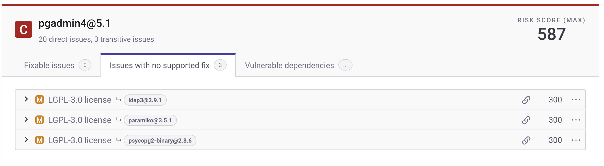
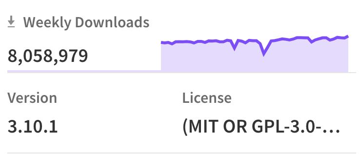
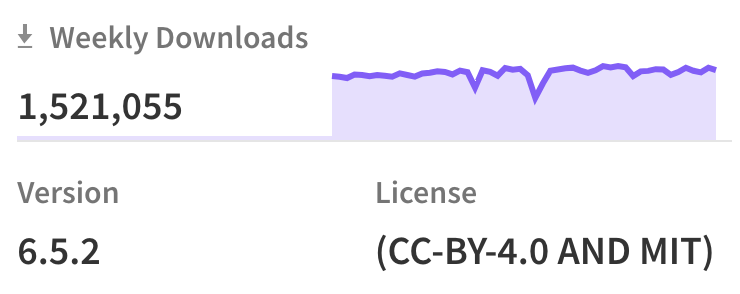

# Open-source license compliance

## Overview of licenses

Every time you test your code in the Snyk web UI, the Snyk CLI, or using PR Checks, your repositories are scanned for vulnerabilities and license compliance. This includes all of your direct and indirect dependencies. Snyk scans your manifest files and checks for license issues against Snyk known licenses.

### Default license policy

To enable customers to get started with license compliance faster, Snyk created a default license policy. The default policy is a baseline that tries to meet the requirements of multiple types of applications, SaaS, distributed, and so on. It may be used as a starting point to calibrate additional license policies. The default policy does not endorse or criticize any license.

By default, Snyk determines the severity of a license issue in the following way:

* High severity - licenses that definitely present issues for commercial software
* Medium severity - licenses with clauses that may be of concern and should be reviewed.

For more information, visit [License policies](../../../manage-risk/policies/license-policies/) and [Open Source Licenses: Types and Comparison](https://snyk.io/learn/open-source-licenses/).

### How Snyk uses licenses

To facilitate the onboarding of your developers, Snyk recommends that your teams review these defaults, update severities, and add instructions based on license type, in line with the policies outlined by your Legal teams.

After the license policy is updated, when Snyk detects a license violation, it is displayed for all users in the Organization in the test results on the Snyk web UI, the Snyk CLI, or PR Checks, in the same way as a security vulnerability, and including the severity and instructions you configured.

Example:

<figure><figcaption>
License issue card in the Snyk Web UI
</figcaption></figure>

## View and manage license policies

You can view an inventory of all of your licenses across all your Projects. For more information, visit [View licenses](../../../manage-risk/dependencies-and-licenses/view-licenses.md).

Different customers may have different needs and tolerance levels for different license types. Snyk encourages you to ensure you have made the needed changes or created new policies that fit your company's specific requirements.

New licenses added by Snyk default to a severity of **None** and do not inherit the **Unknown** license severity. Unless you explicitly configure a severity for the newly supported license, it will not appear in Snyk test results.

If you notice a license with the wrong license type assigned to it, contact Snyk support.

## License updates

Snyk updates the license list in alignment with the latest [SPDX License List](https://spdx.org/licenses/), an integral part of the System Package Data Exchange (SPDX) Specification. To view the full list of supported licenses, see the [License Policy results page](../../../manage-risk/policies/license-policies/license-policy-results.md).

## Multiple licenses

For some packages, a version contains two or even more licenses that apply simultaneously. Snyk calls these dual-licenses or multi-licenses.

There are two types of dual or multiple licenses:

* OR **-** If Snyk recognizes two licenses marked with `OR`being used in a package, this means the customer can comply with either of the licenses.

<figure><figcaption>
Example of an OR license in npm
</figcaption></figure>

* AND **-** If the license explicitly has `AND`, customers must comply with all (dual or multiple) licenses.

<figure><figcaption>
Example of an AND license in npm
</figcaption></figure>

In both of these cases, Snyk displays the severity of the license with the highest severity when displaying issues, where all licenses have a severity.


Licenses on the vulnerability card are sorted with the lowest severity license first, even when the vulnerability card is labeled with the highest severity.

If any of the multiple licenses on the package at the scanned version are set to `severity:none`, then the current behavior is that no license vulnerability is shown.


## **Supported package types**


Snyk does not support scanning for license issues for packages whose version has a git commit hash, for example, crypto@v0.0.0-20191227151644-53104e6ec876.


* C/C++ (Unmanaged)
* Cocoapods
* Composer
* Go
* Maven
* npm
* NuGet
* PyPi
* RubyGems

## Licenses data sources

In certain cases, the developer specifies one license type in the source repository (for example, GitHub, GitLab) and another when releasing the package (for example, to npm, pypi). Snyk ensures the accuracy of license information by examining the package manager's license definition to verify that the licenses match the released package. If the developer did not define the licenses in the package manager, this could result in `unknown` values.
