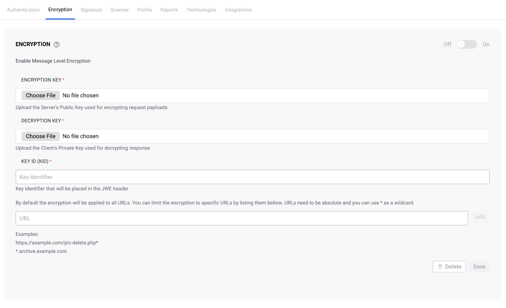

# Configure message level encryption

Configure message level encryption to provide enhanced end-to-end security for API targets in Snyk API & Web.

Message level encryption provides enhanced end-to-end security for message payloads using JSON Web Encryption (JWE). This security measure is crucial for APIs handling sensitive data such as personally identifiable information (PII) or payment information. Message level encryption operates independently of transport security, making it more robust against insider threats.

## Prerequisites

To configure message level encryption, you must have:

- `change_target_settings` permission

Additional requirements:

- Message level encryption feature enabled for your organization (Contact Snyk Sales)

## Configure message level encryption

If your target requires requests to be encrypted, configure message level encryption in the Encryption tab.

1. In Snyk API & Web, navigate to the **Targets** page.
2. Identify the target you want to configure and click the **gear** icon to access the target settings.
3. Click the **Encryption** tab and configure all fields:
   - Upload a certificate with the server public key
   - Upload a certificate with the client private key
   - Enter the Key ID (KID) to be placed in the JWE header
   - (Optional) Limit the set of URLs that should be encrypted
4. Click **Save**.

<figure></figure>

## Verify encryption

After you save the configuration, encryption is enabled. The next time you run a scan against this target, Snyk API & Web automatically uses the configured encryption for all requests.


For your security, all sensitive fields (such as certificates and shared secrets) are obfuscated after they are saved and cannot be viewed or retrieved again.


## Manage encryption settings

You can manage these settings at any time from your target **Encryption** tab:

- To temporarily disable a setting, use the **Off/On** toggle.
- To permanently remove a configuration, use the **Delete** button.
