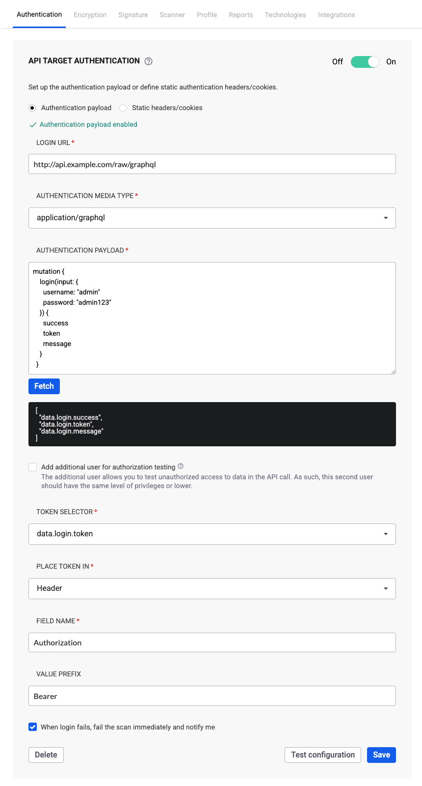

# Configure GraphQL authentication

Configure authentication to scan an API using a GraphQL schema.

If your GraphQL API requires authentication, Snyk API & Web can be configured to run authenticated requests and scan the API endpoints.

After adding an API target, configure authentication before starting the scan. Setting authentication before starting the scan is especially important when you select the introspection option for your schema, as it is best practice to allow introspection only to authenticated requests.


GraphQL Introspection enabled is considered a Low Severity vulnerability. When enabled, restrict access to your GraphQL API using authentication.


## Authentication methods

The authentication scenarios described in [Configure OpenAPI authentication](configure-openapi-authentication.md) work the same way for your GraphQL API:

- **Authenticate with an API token in the request header**: Using `application/json` or `application/x-www-form-urlencoded` media types
- **Authenticate with a static header or cookie**
- **Authenticate with a fixed API key in a request parameter**

## Use application/graphql media type

GraphQL also supports `application/graphql` as the authentication media type. This format is supported by GraphQL servers.

When using `application/graphql` as the authentication media type, the request body contains only the raw GraphQL query or mutation string.

### Configure authentication

1. Navigate to the **Targets** page and click the **gear icon** to access the target settings.
1. Select the **Authentication** tab and locate the **API TARGET AUTHENTICATION** section.

<figure></figure>

1. Configure the authentication:

   1. **AUTHENTICATION MEDIA TYPE**: Select `application/graphql`.

   1. **LOGIN URL**: Enter the authentication URL.

   1. **AUTHENTICATION PAYLOAD**: Enter the GraphQL mutation to be sent in the body of the POST request to the login URL.

1. Click **Fetch** to authenticate. The **TOKEN SELECTOR** field populates with fields obtained from the authentication response. If authentication fails, an error is displayed.
1. In the **TOKEN SELECTOR**, choose the field that contains the authentication token.
1. In **PLACE TOKEN IN**, choose where to place the token in API requests (usually **header**, but **cookie** is also available).
1. In **FIELD NAME**, enter the name of the field in the header or cookie that will hold the token.
1. (Optional) Set a **VALUE PREFIX** for the token value.

   This is often needed for JWTs. For example, if your API requires a header like `Authorization: JWT <token>`, configure:
   - **FIELD NAME**: `Authorization`
   - **VALUE PREFIX**: `JWT`

1. Click **Save and enable**.

You can turn this authentication on or off anytime using the **Off/On** toggle button, or delete the configuration using the **Delete** button.


To test for Broken Object Level Authorization (BOLA) vulnerabilities, you can add an additional user for authorization testing. Visit [Set up your target for testing BOLA vulnerabilities](../../start-scanning/scan-settings/test-bola-vulnerabilities.md) for details.


## Related content

- [Configure OpenAPI authentication](configure-openapi-authentication.md)
