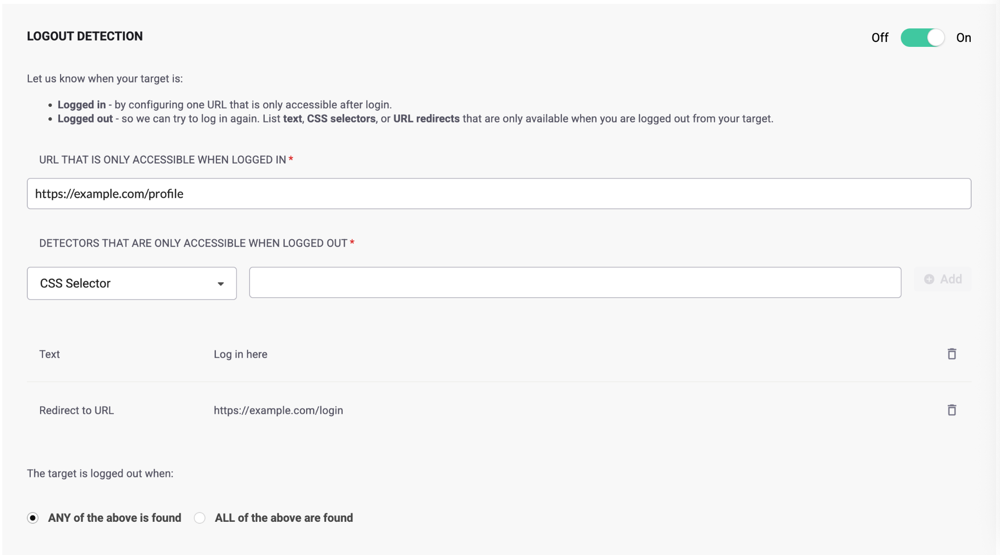
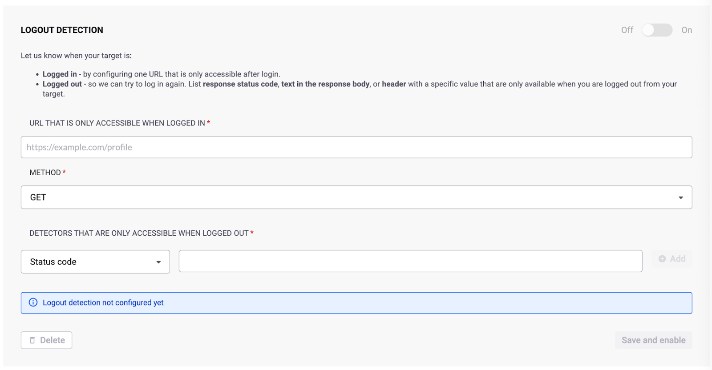
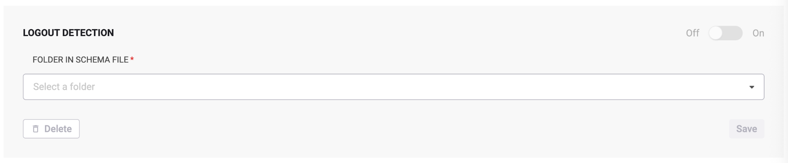

# Configure logout detection

Configure logout detection to help the scanner maintain authenticated sessions throughout the scan.

To effectively scan an application behind its login pages, the scanner must know how to log in and when the session has ended. While some sites make it obvious when the session ends, many do not provide clear indicators for automated systems.

Snyk API & Web has an intelligent mechanism that looks for login selectors after login to determine if the session ended. However, for cases where the site displays text, a button to log back in, or other indicators that automated detection cannot handle reliably, configure logout detection manually.

## Navigate to logout detection settings

1. Log in to your Snyk API & Web account.
2. Navigate to the **Targets** page.
3. Locate the target you want to configure and click the **gear icon** to access the target settings.
4. Select the **Authentication** tab.
5. Scroll down to the **Logout detection** section.

## Configure Web targets

For Web targets, define a URL that is only accessible when logged in, and one or multiple detectors that appear only when logged out. Detectors can be text, CSS selectors, or URL redirects.

After adding multiple detectors, specify whether the target is logged out when **any** of the selectors are found or when **all** of them are found.

<figure></figure>

## Configure OpenAPI targets

For OpenAPI targets, define:
- A URL that is only accessible when logged in to the API
- An HTTP method (GET, POST, PATCH, or PUT)
- Authentication media type
- Payload (if the method is not GET)
- One or multiple detectors (status code, text, or header) that appear only when logged out

<figure></figure>

After adding multiple detectors, specify whether the target is logged out when **any** of the selectors are found or when **all** of them are found.

## Configure Postman targets

For Postman targets, select the folder from the schema file that contains the logout information.

<figure></figure>

Include a test script on the required endpoints. For example:

```javascript
pm.test("Status code is 200", function () {
    pm.response.to.have.status(200);
});
```