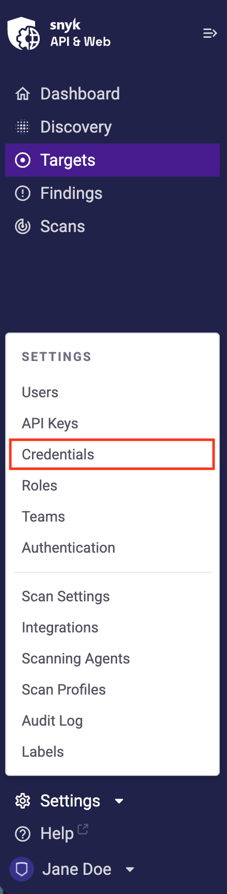
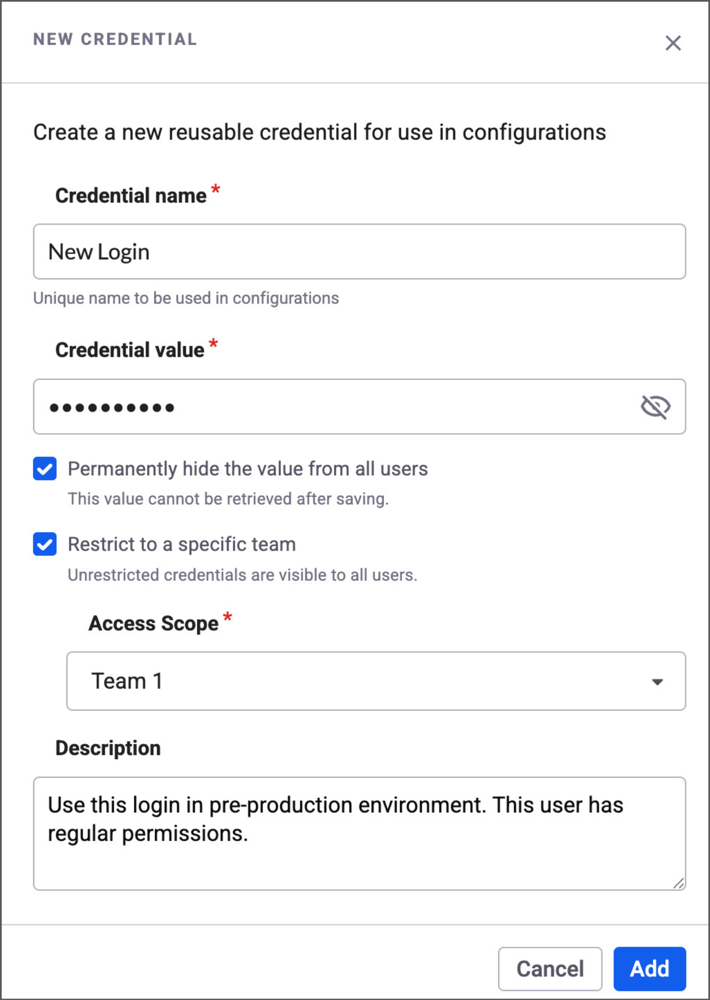
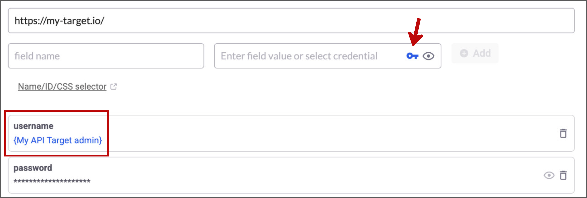

# Manage credentials

Manage and rotate authentication credentials securely across your Snyk API & Web targets.

The Credentials Manager is a centralized hub for handling target authentication data across your account. Instead of re-entering sensitive information for every target, you can manage credentials in one secure location.

Using the Credentials Manager simplifies the password rotation process and improves security for sensitive credentials.

## Add a credential

1. Navigate to the **Credentials** section in your account settings.

<figure></figure>

2. Click **Add Credential**.
3. Configure the credential:
   - **Sensitive**: Enable this option to permanently hide credential values from all users. Sensitive credential values can be updated but never viewed after saving.
   - **Scope**: Choose whether the credential is available account-wide or restricted to specific teams. Account-wide credentials can be used by everyone in the account.
   - **Description** (optional): Add relevant information to help your team understand when to use this credential.
4. Click **Save**.

<figure></figure>

## Link a credential to a target

After creating a credential, link it to any target:

1. Navigate to the **Targets** page.
2. Locate your target and click the **gear icon** to access the target settings.
3. In the authentication or header configuration section, select the option to **Link from Credentials Manager**.
4. Choose the appropriate credential from the dropdown list.

<figure></figure>

## Where you can use credentials

You can securely store sensitive information in several areas across Snyk API & Web. Look for the **Add Credential** icon in the following locations:

**Target Settings > Authentication:**
- Login Form fields
- Custom Variables for Login Sequences
- Authentication Payloads
- Static Headers or Cookies
- Basic Auth username and password

**Target Settings > Scanner:**
- Custom Headers and Cookies
- API Parameter Custom Values
- Postman Environment Values

**Target Settings > Extra Hosts:**
- Custom Headers and Cookies

## Permissions and scope

Access to Credentials depends on your user role and assigned permissions:

- **Update Target Configuration**: Users with this permission can create credentials and use them within their specific targets.
- **Manage Credentials**: Users with this permission can create, view, update, and delete credentials across the account or team, even if the credential was created by someone else.
- **Scoped Credentials**: Credentials can be scoped to the entire account or restricted to users from specific teams.

For more information about permissions, see the Snyk API & Web permissions documentation.

## Transitioning from obfuscated values

The Credentials Manager replaces the Secret Obfuscation feature:

- **Obfuscation Toggle**: The option to turn obfuscation on or off for account owners is hidden. Centralized management through the Credentials Manager is now the standard for sensitive data.
- **Existing Configurations**: All existing configurations continue to work. You can keep them or replace them with Credentials Manager credentials (recommended).
- **Obfuscated Values**: Previously obfuscated values cannot be retrieved. To create new obfuscated values, use Sensitive Credentials in the Credentials Manager.
