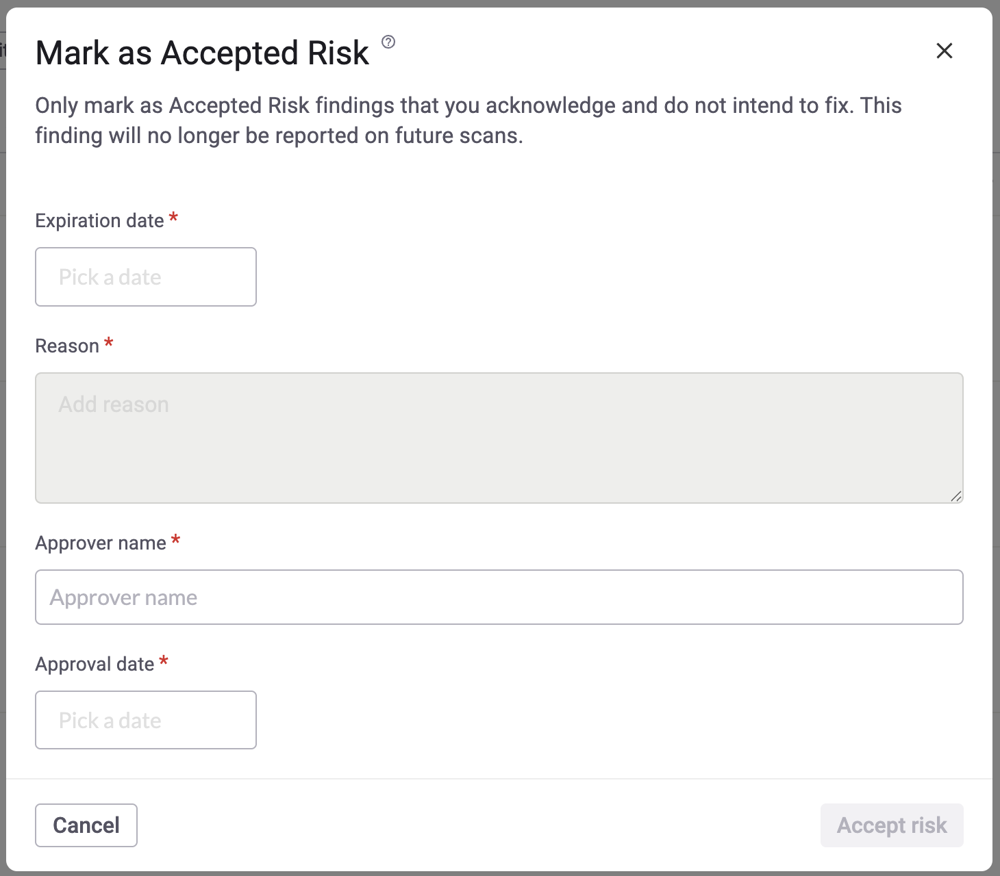

# Configure the risk acceptance workflow

Customize the risk acceptance workflow in Snyk API & Web to align with your organization's internal security and compliance processes.

By configuring this feature, you can require users to provide specific information, such as an expiration date or an approver's name, when they move a finding to the **Accepted Risk** state. This ensures that risk acceptance is consistently documented and periodically reviewed.

## Configure the workflow

As the Account Owner, you can define which fields are mandatory when a user accepts the risk of a finding.

1. From the side menu in your Snyk API & Web account, navigate to **Settings > Scan Settings**.
1. Locate the **RISK ACCEPTANCE WORKFLOW** module.
1. Select the checkboxes for the fields you want to require:
   * **Expiration date** - Requires the user to set a date on which the risk acceptance will automatically expire. If you select this, you can also set a **maximum acceptance period** (in days) to limit how far in the future the expiration date can be.
   * **Approver name** - Requires the user to enter the name of the person who approved the finding.
   * **Approval date** - Requires the user to enter the date when the finding was approved.
1. Click **Save** to apply your changes.

## Accept a finding's risk

Once the workflow is configured, any user accepting a finding's risk is prompted to provide the required information.

1. Navigate to any page where findings are listed (for example, the global **Findings** page or a target's details page).
1. Select one or more findings you wish to accept.
1. From the **State** dropdown menu, select **Accepted Risk**.
1. A dialog box is displayed, listing the custom fields you configured.
1. Fill out the required information and click **Accept risk**.

<figure></figure>

## Verify the outcome

After you submit the form, the state of the selected findings changes to **Accepted Risk**. This action, along with all the information you provided, is recorded in both the individual finding logs and the account audit log.

If an **expiration date** was set for a finding, its state is automatically reverted from **Accepted Risk** back to **Not Fixed** once that date is reached, ensuring it is re-evaluated in future scans.
