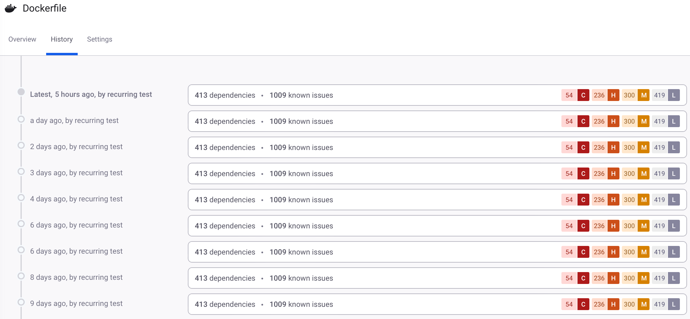

# View Project history

Select the **History** tab on the Project details page to view the Project history, which shows results of previous scans. Under normal circumstances, Snyk retains at least two snapshots: a historic snapshot and a current snapshot of the latest scan. Snyk may show more entries when the found issues between scans have not changed, but the entries in the list point to the same snapshot. If numerous scans run in 24 hours, Snyk displays all of the scans, distinct issues or not, then purges them from the list.

<figure><figcaption>
Project details page History tab
</figcaption></figure>

Click an entry to view a snapshot of the Project details page for that period.
